# Aegis 🛡️

**The First Cross-Chain Circuit Breaker for Uniswap v4 Liquidity.**

> 🏆 **Uniswap Hook Incubator (UHI) Hackathon Entry**
>
> 🎥 **Demo Video**: [Link to Video] (Add later)
> 🔗 **Live Deployment**: [Unichain Sepolia Link] (Add later)

---

## 💡 Inspiration
Liquidity Providers (LPs) on Layer 2s are bleeding money. The problem is **Loss Versus Rebalancing (LVR)**.
When Ethereum Mainnet prices crash, arbitrage bots race to L2s to trade against stale pools before they update. This "toxic flow" costs LPs hundreds of millions annually. We wanted to build a **"Shield"** that uses the speed of **Unichain** to protect LPs from this predation.

## 🚀 What it Does
Aegis is an autonomous security system for your liquidity.
1.  **Watches**: It uses **Reactive Network** to monitor volatility on Ethereum Mainnet 24/7.
2.  **Analyzes**: If it detects a crash (e.g., ETH drops >5% in 5 mins), it triggers a "Panic" signal.
3.  **Protects**: The **Unichain Hook** instantly gates the pool. Swaps are rejected. LPs are safe.
4.  **Resumes**: Once volatility settles, trading re-opens automatically.

## ⚙️ How We Built It
We combined three cutting-edge technologies to make this possible:

### 1. Uniswap v4 Hooks (The Shield)
We built a custom hook (`AegisHook.sol`) that implements a `beforeSwap` gate.
*   **Feature**: `panicMode`. When active, all trades revert.
*   **Why v4?**: Only v4 allows programmatic "pausing" of specific pools without centralization.

### 2. Reactive Network (The Eyes)
We deployed a Reactive Smart Contract (`AegisSentinel.sol`) that listens to cross-chain events.
*   **Integration**: It subscribes to Chainlink Oracle events on Sepolia and triggers a callback on Unichain.
*   **Why Reactive?**: It solves the "Inversion of Control" problem. We don't need to run a python bot server. The contract runs itself.

### 3. Unichain (The Speed)
We deployed on **Unichain Testnet** to leverage **Flashblocks**.
*   **Why Unichain?**: To beat arbitrage bots, we need sub-second 250ms block times. Unichain gives us the speed advantage to "front-run the front-runners."

---

## 🏗️ Architecture

```mermaid
sequenceDiagram
    participant Mainnet as 🔴 Ethereum Mainnet
    participant Sentinel as 🟣 Aegis Sentinel (Reactive)
    participant Hook as 🔵 Aegis Hook (Unichain)
    
    Note over Mainnet: 🚨 CRASH EVENT DETECTED
    Sentinel->>Mainnet: Reads Oracle Data
    Sentinel->>Hook: [Cross-Chain] SET_PANIC(true)
    Note over Hook: 🔒 POOL LOCKED
    participant Bot as 🤖 Arb Bot
    Bot->>Hook: Try to Sell Toxic Flow
    Hook--XBot: REVERT: "Aegis: Pool Paused"
```


## 🛠️ Challenges We Ran Into
*   **Cross-Chain Latency**: synchronizing the "Crash Event" on L1 with the "Pause Action" on L2 is a race against time. We solved this by using Unichain's fast block times to maximize our window of opportunity.
*   **Reactive SDK**: Integrating the new Reactive SDK required deep diving into their system contracts to mock the cross-chain calls locally.

## 🔮 What's Next for Aegis
*   **Granular Protection**: Instead of pausing the whole pool, we plan to implement "Dynamic Spreads" (widen fees during volatility).
*   **Real-World Assets**: Protecting Tokenized Real Estate pools from depeg events.

---

## � Documentation
[Contracts README](contracts/README.md): Smart contract setup, deployment, and testing details.

[Frontend README](frontend/README.md): Dashboard setup and feature documentation.

[Reactive README](reactive/README.md): Reactive Network listener usage and configuration.

---

## �💻 Quick Start
```bash
# 1. Install
git clone https://github.com/ogazboiz/aegis.git
cd aegis/contracts
forge install

# 2. Test
forge test
```

## 👥 Team
*   **Ogazboiz** - Full Stack Developer

---
*Built with ❤️ for the Uniswap Hook Incubator.*
