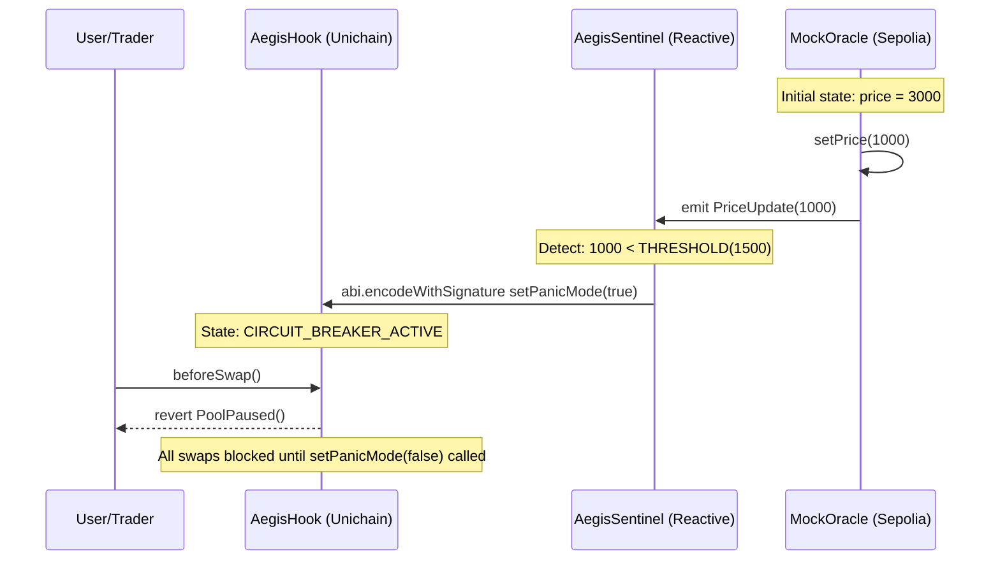

# Aegis: Autonomous Liquidity Defense

## Purpose and Scope

This document provides a high-level introduction to the Aegis cross-chain circuit breaker system. It explains the problem Aegis solves, introduces the core smart contracts and their roles, and describes the cross-chain architecture that enables automated liquidity protection on Uniswap v4.

For detailed architectural patterns and design decisions, see [System Architecture](./docs/System-Architecture.md). For individual contract specifications, see [Core Smart Contracts](./docs/Core-Smart-Contracts.md). For deployment procedures and network configuration, see [Deployment](./docs/Deployment.md).

## � Documentation Portal

Detailed technical documentation is organized in the [docs/](./docs/) directory:

- **[🚀 Development Guide](./docs/Development-Guide.md)**: Environment setup and quickstart.
- **[🏗️ System Architecture](./docs/System-Architecture.md)**: Deep dive into the Reactive Network design.
- **[📜 Core Smart Contracts](./docs/Core-Smart-Contracts.md)**: Analysis of Hook, Sentinel, and Oracle logic.
- **[🛡️ Guardian Registry](./docs/Guardian-Registry.md)**: ERC-8004 Identity and Reputation system.
- **[🎮 Frontend Dashboard](./docs/Frontend-Dashboard.md)**: React UI, glassmorphism, and real-time updates.
- **[🌉 Hybrid Relayer](./docs/Hybrid-Relayer.md)**: The cross-chain bridge between Sepolia and Unichain.
- **[� Project Structure](./docs/Project-Structure.md)**: Monorepo organization and file layout.

---

## Problem Statement: Loss Versus Rebalancing (LVR)

Liquidity Providers on Layer 2 exchanges suffer from Loss Versus Rebalancing (LVR), a form of adverse selection where arbitrage bots exploit stale pool prices during market volatility. When Ethereum mainnet experiences a price crash, arbitrageurs race to L2 chains to trade against Automated Market Maker (AMM) pools before price oracles update, extracting value from LPs through what is known as "toxic flow."

Aegis addresses this by implementing an autonomous circuit breaker that:

1. Monitors price volatility on Ethereum Sepolia (L1) via oracle events
2. Detects crash conditions (e.g., >50% price drop) using the Reactive Network
3. Instantly gates Uniswap v4 pools on Unichain Sepolia (L2) to prevent exploitation
4. Resumes trading automatically when volatility subsides

This architecture leverages Unichain's 250ms Flashblocks to "front-run the front-runners," closing the temporal arbitrage window before toxic flow can drain LP positions.

---

## System Components

Aegis consists of four core smart contracts deployed across three blockchain networks:

| Contract | File | Network | Role |
| --- | --- | --- | --- |
| `MockOracle` | `contracts/src/MockOracle.sol` | Ethereum Sepolia | Price feed source; emits `PriceUpdate` events |
| `AegisSentinel` | `contracts/src/AegisSentinel.sol` | Reactive Lasna | Event listener; triggers cross-chain actions |
| `AegisHook` | `contracts/src/AegisHook.sol` | Unichain Sepolia | Uniswap v4 hook; gates swaps via `beforeSwap` |
| `AegisGuardianRegistry` | `contracts/src/AegisGuardianRegistry.sol` | Ethereum Sepolia | ERC-721 + ERC-8004 identity and reputation registry |

### Component Architecture Diagram

```mermaid
flowchart TD
    User([User/Trader])
    Hook[AegisHook (Unichain)]
    Sentinel[AegisSentinel (Reactive)]
    Oracle[MockOracle (Sepolia)]

    User -->|Swap| Hook
    Oracle -->|PriceUpdate| Sentinel
    Sentinel -->|setPanicMode| Hook
```

---

## Core Workflow: Circuit Breaker Activation

The following sequence demonstrates how Aegis responds to a market crash event:

### Cross-Chain Message Flow



### Key Functions and Events

| Component | Function/Event | Purpose |
| --- | --- | --- |
| `MockOracle` | `setPrice(uint256 newPrice)` | Simulates price update; emits `PriceUpdate` |
| `MockOracle` | `event PriceUpdate(uint256 price, uint256 timestamp)` | Signals price change to Sentinel |
| `AegisSentinel` | `react(...)` | Callback invoked by Reactive Network; checks threshold |
| `AegisSentinel` | Cross-chain call to `setPanicMode(bool)` | Activates/deactivates circuit breaker on L2 |
| `AegisHook` | `beforeSwap(...)` | Intercepts swap attempts; reverts if `panicMode == true` |
| `AegisHook` | `error PoolPaused()` | Revert reason when circuit breaker active |

---

## Key Features

### 1. Autonomous Event-Driven Architecture

Aegis eliminates the need for centralized keeper bots by leveraging the Reactive Network's inversion-of-control model. The `AegisSentinel` contract subscribes to L1 events and autonomously triggers L2 state changes without external coordination.

- **Subscribe**: Sentinel registers for `PriceUpdate` events on Sepolia
- **React**: Reactive Network invokes `react()` callback when event matches
- **Execute**: Sentinel sends cross-chain message to Unichain via Reactive Network bridge

### 2. Reputation-Aware Gating (ERC-8004)

The system implements a trust layer using ERC-8004 (Trustless Agents) and ERC-721 for Guardian identity management:

- **Identity**: Guardians mint an `AegisGuardian` NFT to establish on-chain identity
- **Heroic Interventions**: When agents provide liquidity during panic mode, `AegisHook` records intervention volume
- **Reputation Sync**: Sentinel listens to `NewFeedback` events and calls `boostReputation()` on L2
- **VIP Lane**: Guardians with reputation > 90 pay reduced fees (0.01%) even during panic

### 3. Hybrid Relayer Fallback

To ensure message delivery reliability during testnet instability, Aegis includes a fallback relay mechanism:

- **Primary**: Reactive Network's public relayer handles cross-chain message forwarding
- **Fallback**: Custom TypeScript relayer (`relay.ts`) monitors Oracle directly and forwards messages if public relayer experiences delays
- **Implementation**: See [Hybrid Relayer](./docs/Hybrid-Relayer.md) for details

---

## Technology Stack

### Protocol Integrations

| Technology | Version/Chain | Purpose |
| --- | --- | --- |
| **Uniswap v4** | Hooks Framework | Provides `beforeSwap` gate mechanism via BaseHook interface |
| **Reactive Network** | Lasna Testnet | Event-driven cross-chain orchestration; AbstractReactive base |
| **Unichain** | Sepolia Testnet | 250ms Flashblocks enable sub-second circuit breaker activation |
| **Foundry** | Latest | Smart contract development, testing, and deployment framework |

### Development Dependencies

The project uses git submodules for external libraries:

- `lib/forge-std`: Foundry standard library for testing utilities
- `lib/uniswap-hooks`: OpenZeppelin's Uniswap v4 hook implementation templates
- `lib/hookmate`: Hook utility functions (e.g., salt mining for permissions)
- `lib/system-smart-contracts`: Reactive Network core contracts (`AbstractReactive`)

For dependency management details, see [Dependencies and Submodules](./docs/Dependencies-and-Submodules.md).

---

## Repository Structure

```
aegis/
├── contracts/               # Foundry project
│   ├── src/                 # Smart contract source files
│   │   ├── AegisHook.sol           # Uniswap v4 hook (L2)
│   │   ├── AegisSentinel.sol       # Reactive listener (Reactive)
│   │   ├── MockOracle.sol          # Price feed simulator (L1)
│   │   └── AegisGuardianRegistry.sol  # Identity & reputation (L1)
│   ├── script/              # Deployment scripts
│   │   ├── 04_DeployOracle.s.sol   # Deploy to Sepolia
│   │   ├── 05_DeploySentinel.s.sol # Deploy to Reactive
│   │   └── 06_DeployHook.s.sol     # Deploy to Unichain
│   ├── test/                # Test suites
│   ├── lib/                 # Git submodules (dependencies)
│   ├── foundry.toml         # Foundry configuration
│   └── broadcast/           # Deployment transaction logs
├── frontend/                # Next.js dashboard
│   └── src/                 # Frontend source code
└── README.md                # Project documentation
```

For detailed directory structure and file organization, see [Project Structure](./docs/Project-Structure.md).

---

## Quick Start

### Prerequisites

- Foundry installed (`curl -L https://foundry.paradigm.xyz | bash`)
- Node.js v18+ and npm

### Testing Locally

```bash
# Clone repository
git clone https://github.com/HACK3R-CRYPTO/Aegis.git
cd Aegis/contracts

# Install dependencies (submodules)
forge install

# Run test suite
forge test

# Run circuit breaker integration test
forge test --match-contract AegisIntegrationTest -vv
```

### Running Dashboard

```bash
cd frontend
npm install

# Start hybrid relayer (background)
npm run relay &

# Start Next.js dashboard
npm run dev
# Navigate to http://localhost:3000
```

For detailed deployment to testnets, see [Deployment Scripts](./docs/Deployment-Scripts.md).

---

## Design Philosophy: Simulation vs. Production

The current implementation uses `MockOracle` for deterministic testing and demonstration purposes. This design choice enables:

1. **Controlled Testing**: Simulate 50% market crash events on-demand via `setPrice(1000)`
2. **Demo Reliability**: Guarantee circuit breaker activation during presentations without waiting for real market volatility
3. **Interface Agnostic**: `AegisSentinel` listens for standard `PriceUpdate(uint256, uint256)` event signature; production deployment simply swaps `MockOracle` address for Chainlink Oracle address with zero code changes

---

## Verification and Testing

Aegis includes comprehensive integration tests that verify the complete cross-chain flow:

| Test Case | Validation | Status |
| --- | --- | --- |
| Oracle Update | `MockOracle.setPrice()` emits `PriceUpdate` event | ✅ PASS |
| Access Control | Only `AegisSentinel` can call `AegisHook.setPanicMode()` | ✅ PASS |
| Panic Trigger | Sentinel successfully calls `setPanicMode(true)` cross-chain | ✅ PASS |
| Circuit Breaker | `AegisHook.beforeSwap()` reverts with `PoolPaused()` when active | ✅ PASS |

For step-by-step verification walkthrough, see [walkthrough.md](./walkthrough.md).

---

## Next Steps

- For detailed architectural patterns including cross-chain design and circuit breaker mechanics, see [System Architecture](./docs/System-Architecture.md)
- For contract-level specifications and function signatures, see [Core Smart Contracts](./docs/Core-Smart-Contracts.md)
- For off-chain components including the hybrid relayer and dashboard, see [Supporting Components](./docs/Supporting-Components.md)
- For deployment procedures and network configuration, see [Deployment](./docs/Deployment.md)
- For development workflow and contributing guidelines, see [Development Guide](./docs/Development-Guide.md)
