# Aegis Smart Contracts

**The Shield. The Sentinel. The Oracle.**

This folder contains the on-chain logic that powers Aegis. It is a monorepo containing the L2 Hook, the Cross-Chain Listener, and the L1 Trigger.

## 🏗️ Architecture

The system bridges Ethereum Mainnet (L1) and Unichain (L2) using the Reactive Network.

```mermaid
graph TD
    subgraph L1 [🔴 Ethereum Sepolia]
        Oracle[Mock Oracle] -- "1. Emits PriceUpdate(1000)" --> Reactive
    end

    subgraph RN [🟣 Reactive Network]
        Reactive[Aegis Sentinel] -- "2. Detects Crash (< 1500)" --> Reactive
        Reactive -- "3. Sends Cross-Chain Call" --> Hook
    end

    subgraph L2 [🔵 Unichain Testnet]
        Hook[Aegis Hook] -- "4. Sets panicMode = true" --> Hook
        User[LP/Trader] -- is blocked --> Hook
    end
```



## What's Inside

We didn't just write a script. We built a system.

### 1. The Shield (Unichain)
**`src/AegisHook.sol`**
This is the gatekeeper. It attaches to a specific Uniswap v4 Pool on Unichain.
*   **Normal State**: Swaps flow freely.
*   **Panic State**: Swaps revert instantly.
*   **Mechanism**: Implements `beforeSwap`. Checks a boolean `panicMode`. If true, it throws `PoolPaused()`.

### 2. The Brain (Reactive Network)
**`src/AegisSentinel.sol`**
This is the autonomous watcher. It lives on the Reactive Network, sitting between L1 and L2.
*   **Role**: It listens to Ethereum Sepolia for `PriceUpdate` events.
*   **Logic**: If `price < THRESHOLD`, it fires a cross-chain message to Unichain.
*   **Why**: It replaces the need for a centralized "Keeper" bot. The contract itself is the bot.

### 3. The Trigger (Sepolia)
**`src/MockOracle.sol`**
This simulates the real world.
*   **Role**: Acts as a Chainlink Oracle feed for testing.
*   **Usage**: We call `setPrice(1000)` to simulate a 50% market crash, triggering the entire defense sequence.

## 🧪 Design Decisions: Simulation vs. Production

### Why use a Mock Oracle?

For this Hackathon demonstration, we utilize a `MockOracle` instead of a live Chainlink feed for one critical reason: **Determinism**.

To effectively demonstrate the **Reactive Sentinel's** capabilities to the judges, we must be able to simulate a "Black Swan" market crash event on command. Waiting for a live price deviation of >50% on a testnet is not feasible for a 3-minute demo.

*   **Production Readiness**: The `AegisSentinel` logic is interface-agnostic. It listens for the standard `PriceUpdate` event signature. In a mainnet deployment, the `MockOracle` address is simply swapped for the official Chainlink Oracle address with zero code changes required in the Sentinel logic.
*   **Demo Reliability**: This architecture guarantees that our cross-chain "Rescue Operation" triggers exactly when needed during the presentation.

## How to Deploy

We use **Foundry** for professional-grade development.

### 1. Build the System
```bash
forge build
```

### 2. Run the Simulations
We proved the logic works with local integration tests.
```bash
forge test --match-contract AegisIntegrationTest -vv
```

### 3. Deploy to Testnets
We have successfully deployed the system across 3 networks.

| Contract | Network | Address | Description |
| :--- | :--- | :--- | :--- |
| **MockOracle** | Sepolia (L1) | `0x29f8f8d2A00330F9683e73a926F61AE7E91cBA3b` | Simulates ETH Price |
| **AegisHook** | Unichain (L2) | `0xBaa0573e3BE4291b58083e717E9EF5051772C080` | v4 Hook (Panic Mode) |
| **AegisSentinel** | Reactive Lasna | `0x0f764437ffBE1fcd0d0d276a164610422710B482` | Listener & Controller |

**Deployment Commands Used:**

*   **Sepolia (Oracle)**:
    ```bash
    forge script script/04_DeployOracle.s.sol --rpc-url sepolia --broadcast
    ```

*   **Reactive (Sentinel - Lasna)**:
    ```bash
    # Note: Requires manual subscription call after deployment
    forge script script/05_DeploySentinel.s.sol --rpc-url reactive --broadcast --legacy
    ```

*   **Unichain (Hook)**:
    ```bash
    # Uses salt mining for permissions
    forge script script/06_DeployHook.s.sol --rpc-url unichain_sepolia --broadcast
    ```
