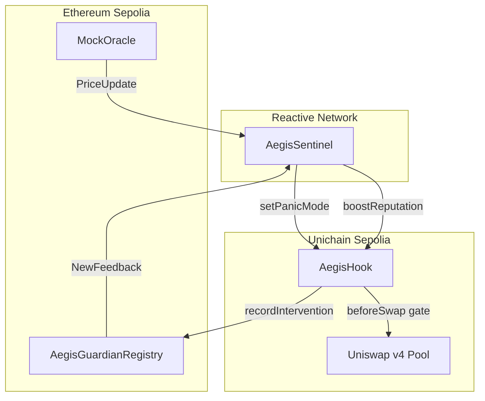
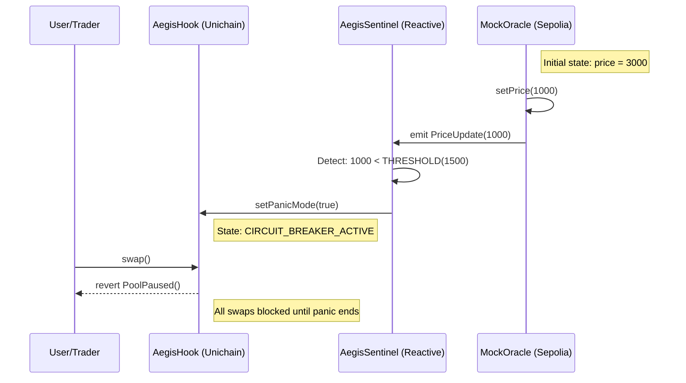

# Aegis Overview

## Purpose and Scope

This document provides a high-level introduction to the Aegis cross-chain circuit breaker system. It explains the problem Aegis solves, introduces the core smart contracts and their roles, and describes the cross-chain architecture that enables automated liquidity protection on Uniswap v4.

For detailed architectural patterns and design decisions, see [System Architecture](System-Architecture.md). For individual contract specifications, see [Core Smart Contracts](Core-Smart-Contracts.md). For deployment procedures and network configuration, see [Deployment](Deployment.md).

## Problem Statement: Loss Versus Rebalancing (LVR)

Liquidity Providers on Layer 2 exchanges suffer from Loss Versus Rebalancing (LVR), a form of adverse selection where arbitrage bots exploit stale pool prices during market volatility. When Ethereum mainnet experiences a price crash, arbitrageurs race to L2 chains to trade against Automated Market Maker (AMM) pools before price oracles update, extracting value from LPs through what is known as "toxic flow."

Aegis addresses this by implementing an autonomous circuit breaker that:

1.  **Monitors** price volatility on Ethereum Sepolia (L1) via oracle events.
2.  **Detects** crash conditions (e.g., >50% price drop) using the Reactive Network.
3.  **Instantly gates** Uniswap v4 pools on Unichain Sepolia (L2) to prevent exploitation.
4.  **Resumes trading** automatically when volatility subsides.

This architecture leverages Unichain's 250ms Flashblocks to "front-run the front-runners," closing the temporal arbitrage window before toxic flow can drain LP positions.

## System Components

Aegis consists of four core smart contracts deployed across three blockchain networks:

| Contract | File | Network | Role |
| :--- | :--- | :--- | :--- |
| `MockOracle` | `contracts/src/MockOracle.sol` | Ethereum Sepolia | Price feed source; emits `PriceUpdate` events |
| `AegisSentinel` | `contracts/src/AegisSentinel.sol` | Reactive Lasna | Event listener; triggers cross-chain actions |
| `AegisHook` | `contracts/src/AegisHook.sol` | Unichain Sepolia | Uniswap v4 hook; gates swaps via `beforeSwap` |
| `AegisGuardianRegistry` | `contracts/src/AegisGuardianRegistry.sol` | Ethereum Sepolia | ERC-721 + ERC-8004 identity and reputation registry |

### Component Architecture Diagram



## Core Workflow: Circuit Breaker Activation

The following sequence demonstrates how Aegis responds to a market crash event:

### Cross-Chain Message Flow



### Key Functions and Events

| Component | Function/Event | Purpose |
| :--- | :--- | :--- |
| `MockOracle` | `setPrice(uint256 newPrice)` | Simulates price update; emits `PriceUpdate` |
| `MockOracle` | `event PriceUpdate(...)` | Signals price change to Sentinel |
| `AegisSentinel` | `react(...)` | Reactive callback; checks threshold and triggers L2 |
| `AegisHook` | `beforeSwap(...)` | Intercepts swap attempts; reverts if `panicMode == true` |
| `AegisHook` | `error PoolPaused()` | Revert reason when circuit breaker active |

## Key Features

### 1. Autonomous Event-Driven Architecture
Aegis eliminates the need for centralized keeper bots by leveraging the Reactive Network's inversion-of-control model. The `AegisSentinel` contract subscribes to L1 events and autonomously triggers L2 state changes without external coordination.

### 2. Reputation-Aware Gating (ERC-8004)
The system implements a trust layer using ERC-8004 (Trustless Agents) and ERC-721 for Guardian identity management:
*   **Identity**: Guardians mint an `AegisGuardian` NFT.
*   **Heroic Interventions**: When agents provide liquidity during panic mode, `AegisHook` records intervention volume.
*   **Reputation Sync**: Sentinel listens to `NewFeedback` events and calls `boostReputation()` on L2.
*   **VIP Lane**: Guardians with reputation > 90 pay reduced fees (0.01%) even during panic.

### 3. Hybrid Relayer Fallback
To ensure message delivery reliability during testnet instability, Aegis includes a fallback relay mechanism:
*   **Primary**: Reactive Network's public relayer handles cross-chain message forwarding.
*   **Fallback**: Custom TypeScript relayer (`relay.ts`) monitors Oracle directly and forwards messages.

## Technology Stack

### Protocol Integrations

| Technology | Purpose |
| :--- | :--- |
| **Uniswap v4** | Hooks Framework provides `beforeSwap` gate mechanism via BaseHook interface |
| **Reactive Network** | Event-driven cross-chain orchestration; AbstractReactive base |
| **Unichain** | 250ms Flashblocks enable sub-second circuit breaker activation |
| **Foundry** | Smart contract development, testing, and deployment framework |

### Development Dependencies
The project uses git submodules for external libraries:
*   `lib/forge-std`: Foundry standard library.
*   `lib/uniswap-hooks`: OpenZeppelin's Uniswap v4 hook implementation templates.
*   `lib/hookmate`: Hook utility functions (e.g., salt mining).
*   `lib/system-smart-contracts`: Reactive Network core contracts.

## Repository Structure

```
aegis/
├── contracts/               # Foundry project
│   ├── src/                 # Smart contract source files
│   ├── script/              # Deployment scripts
│   ├── test/                # Test suites
│   └── broadcast/           # Deployment transaction logs
├── frontend/                # Next.js dashboard
└── docs/                    # Documentation
```

## Quick Start

### Prerequisites
*   Foundry installed (`curl -L https://foundry.paradigm.xyz | bash`)
*   Node.js v18+ and npm

### Testing Locally
```bash
# Clone repository
git clone https://github.com/HACK3R-CRYPTO/Aegis.git
cd Aegis/contracts

# Install dependencies
forge install

# Run test suite
forge test
```

### Running Dashboard
```bash
cd frontend
npm install
npm run dev
# Navigate to http://localhost:3000
```

## Design Philosophy: Simulation vs. Production

The current implementation uses `MockOracle` for deterministic testing and demonstration purposes. This design choice enables:
1.  **Controlled Testing**: Simulate 50% market crash events on-demand via `setPrice(1000)`.
2.  **Demo Reliability**: Guarantee circuit breaker activation during presentations.
3.  **Interface Agnostic**: `AegisSentinel` listens for standard `PriceUpdate` events, making it swap-ready for Chainlink oracles in production.

## Verification and Testing
Aegis includes comprehensive integration tests that verify the complete cross-chain flow:
*   ✅ **Oracle Update**: `MockOracle` emits `PriceUpdate`.
*   ✅ **Panic Trigger**: Sentinel calls `setPanicMode(true)`.
*   ✅ **Circuit Breaker**: `beforeSwap` reverts with `PoolPaused`.