# AegisHook
Relevant source files
- [contracts/README.md](https://github.com/HACK3R-CRYPTO/Aegis/blob/5ea5ecc2/contracts/README.md)
- [contracts/broadcast/06_DeployHook.s.sol/1301/run-1769587735298.json](https://github.com/HACK3R-CRYPTO/Aegis/blob/5ea5ecc2/contracts/broadcast/06_DeployHook.s.sol/1301/run-1769587735298.json)
- [contracts/broadcast/06_DeployHook.s.sol/1301/run-latest.json](https://github.com/HACK3R-CRYPTO/Aegis/blob/5ea5ecc2/contracts/broadcast/06_DeployHook.s.sol/1301/run-latest.json)

## Purpose and Scope

This document describes the AegisHook contract, the core circuit breaker mechanism deployed on Unichain Sepolia (L2) that integrates with Uniswap v4 pools to provide autonomous protection against extreme market volatility. AegisHook implements a Uniswap v4 hook that can pause all swap operations when triggered by cross-chain signals from the AegisSentinel.

For information about the autonomous monitoring system that triggers panic mode, see [AegisSentinel](/HACK3R-CRYPTO/Aegis/2.2-aegissentinel). For details on the Oracle that provides price feeds, see [MockOracle](/HACK3R-CRYPTO/Aegis/2.1-mockoracle). For information about the Guardian reputation system, see [AegisGuardianRegistry](/HACK3R-CRYPTO/Aegis/2.4-aegisguardianregistry).

**Sources:**[contracts/README.md1-123](https://github.com/HACK3R-CRYPTO/Aegis/blob/5ea5ecc2/contracts/README.md#L1-L123)[contracts/broadcast/06_DeployHook.s.sol/1301/run-1769587735298.json1-58](https://github.com/HACK3R-CRYPTO/Aegis/blob/5ea5ecc2/contracts/broadcast/06_DeployHook.s.sol/1301/run-1769587735298.json#L1-L58)

## Contract Overview

AegisHook is a Uniswap v4 hook contract that enforces a circuit breaker pattern on liquidity pools during extreme market conditions.

### Deployment Information
PropertyValue**Network**Unichain Sepolia (L2)**Chain ID**1301**Contract Address**`0xBaa0573e3BE4291b58083e717E9EF5051772C080`**Deployment Method**CREATE2 with salt mining**Transaction Hash**`0x1a6abff8b974723219d62b4b8f9ac4d27fd24e11fe23c03f21a392574c5458d7`**Constructor Arguments**PoolManager: `0x00B036B58a818B1BC34d502D3fE730Db729e62AC`Owner: `0xd2df53D9791e98Db221842Dd085F4144014BBE2a`
**Sources:**[contracts/broadcast/06_DeployHook.s.sol/1301/run-1769587735298.json1-58](https://github.com/HACK3R-CRYPTO/Aegis/blob/5ea5ecc2/contracts/broadcast/06_DeployHook.s.sol/1301/run-1769587735298.json#L1-L58)[contracts/README.md99-122](https://github.com/HACK3R-CRYPTO/Aegis/blob/5ea5ecc2/contracts/README.md#L99-L122)

## System Architecture

### Cross-Chain Integration

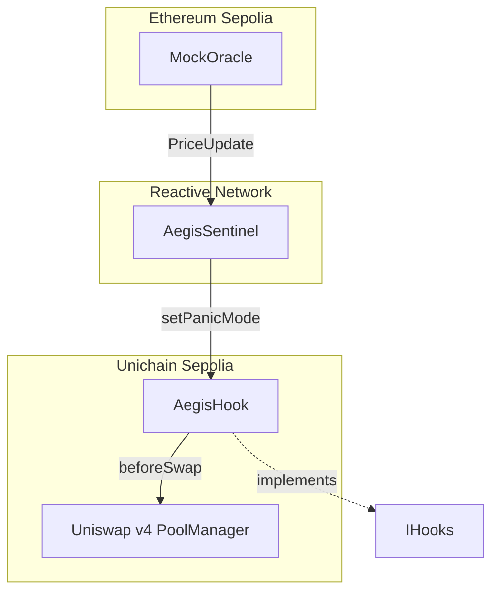

**Sources:**[contracts/README.md11-26](https://github.com/HACK3R-CRYPTO/Aegis/blob/5ea5ecc2/contracts/README.md#L11-L26)

### Hook Flags and Permissions

AegisHook requires the `BEFORE_SWAP` flag, which corresponds to an address prefix of `0x80...`. This is achieved through CREATE2 salt mining during deployment.

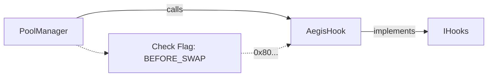

**Sources:**[contracts/README.md32-37](https://github.com/HACK3R-CRYPTO/Aegis/blob/5ea5ecc2/contracts/README.md#L32-L37)

## Core Functionality

### Circuit Breaker Mechanism

The primary function of AegisHook is to implement a circuit breaker that can halt trading during market crises.

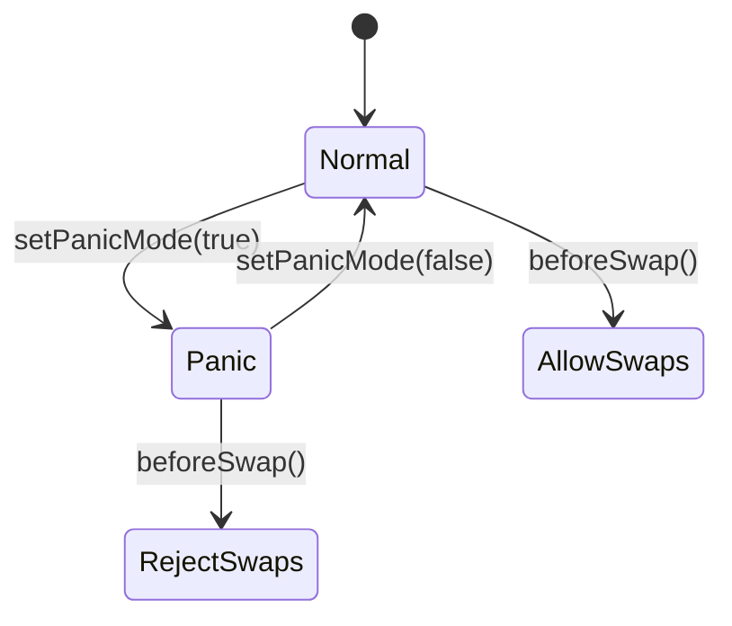

**Sources:**[contracts/README.md32-37](https://github.com/HACK3R-CRYPTO/Aegis/blob/5ea5ecc2/contracts/README.md#L32-L37)

### Swap Interception Flow

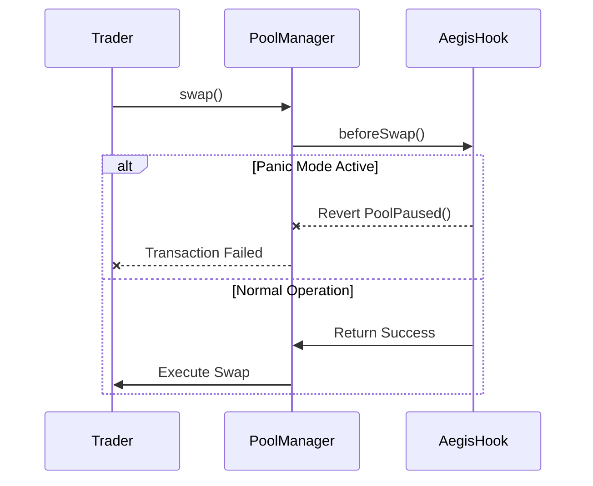

**Sources:**[contracts/README.md32-37](https://github.com/HACK3R-CRYPTO/Aegis/blob/5ea5ecc2/contracts/README.md#L32-L37)

## Access Control System

### Owner and Sentinel Roles

AegisHook implements a dual access control system:
RoleAddress TypePermissionsPurpose**Owner**EOA (Deployer)Administrative functionsEmergency recovery and upgrades**Sentinel**Contract Address`setPanicMode()`Cross-chain autonomous control
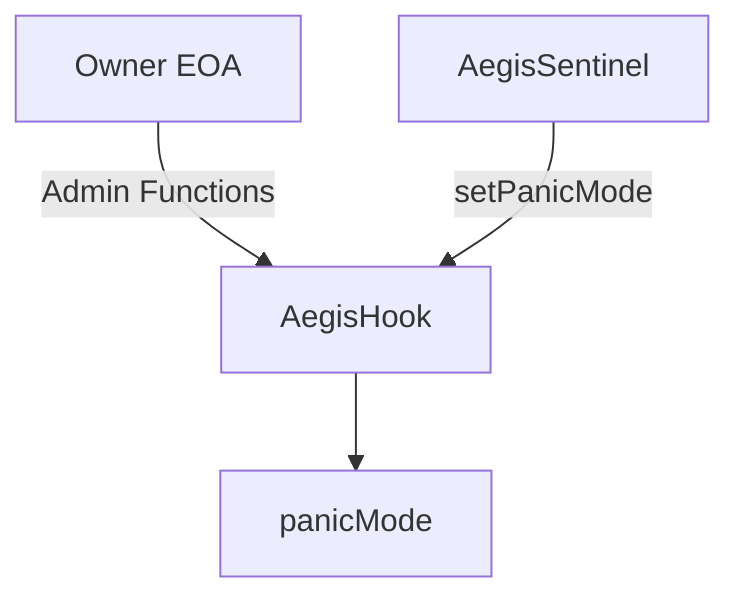

**Sources:**[contracts/README.md39-45](https://github.com/HACK3R-CRYPTO/Aegis/blob/5ea5ecc2/contracts/README.md#L39-L45)

### Authorization Check Pattern

The contract enforces that only the AegisSentinel contract on the Reactive Network can trigger panic mode, preventing unauthorized activation of the circuit breaker.

**Sources:**[contracts/README.md39-45](https://github.com/HACK3R-CRYPTO/Aegis/blob/5ea5ecc2/contracts/README.md#L39-L45)[contracts/README.md86-94](https://github.com/HACK3R-CRYPTO/Aegis/blob/5ea5ecc2/contracts/README.md#L86-L94)

## Hook Address Requirements

### CREATE2 Salt Mining

To satisfy Uniswap v4's hook flag requirements, the AegisHook address must start with `0x80...` to indicate the `BEFORE_SWAP` permission.

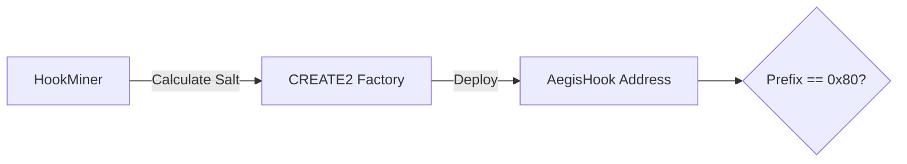

For detailed information on the salt mining process, see [Hook Mining](/HACK3R-CRYPTO/Aegis/3.4-hook-mining).

**Sources:**[contracts/README.md119-122](https://github.com/HACK3R-CRYPTO/Aegis/blob/5ea5ecc2/contracts/README.md#L119-L122)[contracts/broadcast/06_DeployHook.s.sol/1301/run-1769587735298.json4-12](https://github.com/HACK3R-CRYPTO/Aegis/blob/5ea5ecc2/contracts/broadcast/06_DeployHook.s.sol/1301/run-1769587735298.json#L4-L12)

## State Management

### Core State Variables

The AegisHook maintains minimal state for efficient gas usage:
VariableTypePurposeAccess`panicMode``bool`Circuit breaker stateRead: public, Write: Sentinel only`poolManager``address`Uniswap v4 PoolManager referenceImmutable (constructor)`owner``address`Contract administratorImmutable (constructor)
**Sources:**[contracts/README.md32-37](https://github.com/HACK3R-CRYPTO/Aegis/blob/5ea5ecc2/contracts/README.md#L32-L37)

### State Transitions

```mermaid
graph TD
    Constr[Constructor] --> False[panicMode = false]
    False -->|Sentinel calls setPanicMode(true)| True[panicMode = true]
    True -->|Sentinel calls setPanicMode(false)| False
    
    False -.->|beforeSwap| Success[Allow Swaps]
    True -.->|beforeSwap| Revert[Revert Swaps]
```

**Sources:**[contracts/README.md32-37](https://github.com/HACK3R-CRYPTO/Aegis/blob/5ea5ecc2/contracts/README.md#L32-L37)

## Integration with Uniswap v4

### Hook Interface Implementation

AegisHook implements the `IHooks` interface from Uniswap v4, specifically overriding the `beforeSwap()` callback:

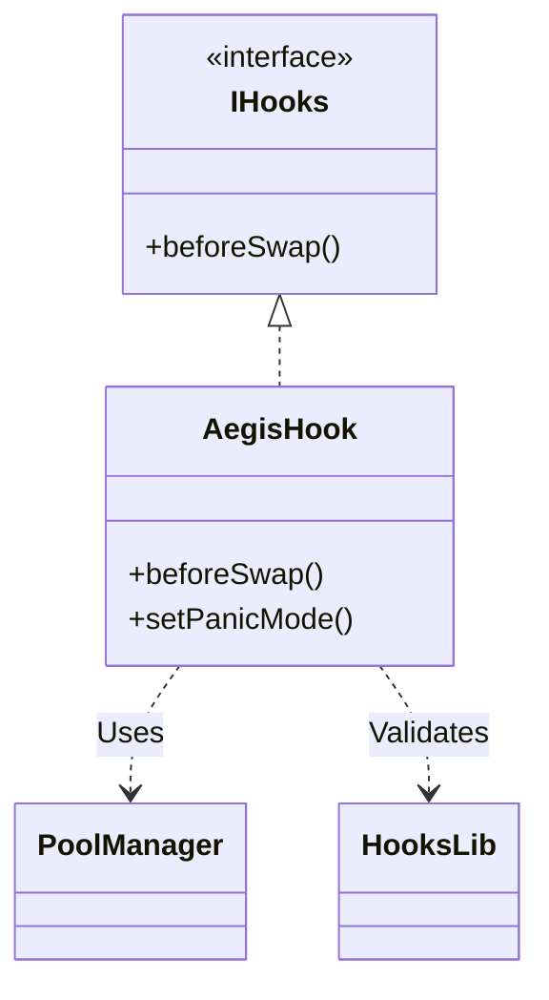

**Sources:**[contracts/README.md32-37](https://github.com/HACK3R-CRYPTO/Aegis/blob/5ea5ecc2/contracts/README.md#L32-L37)

### beforeSwap() Execution Path

The `beforeSwap()` function is the critical enforcement point where the circuit breaker logic is applied:

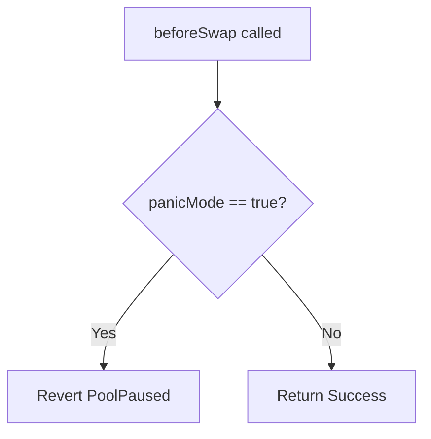

**Sources:**[contracts/README.md32-37](https://github.com/HACK3R-CRYPTO/Aegis/blob/5ea5ecc2/contracts/README.md#L32-L37)[contracts/README.md86-94](https://github.com/HACK3R-CRYPTO/Aegis/blob/5ea5ecc2/contracts/README.md#L86-L94)

## Guardian Integration

### VIP Lane Mechanism

AegisHook integrates with the AegisGuardianRegistry to provide preferential treatment to verified guardians who have established on-chain reputation:

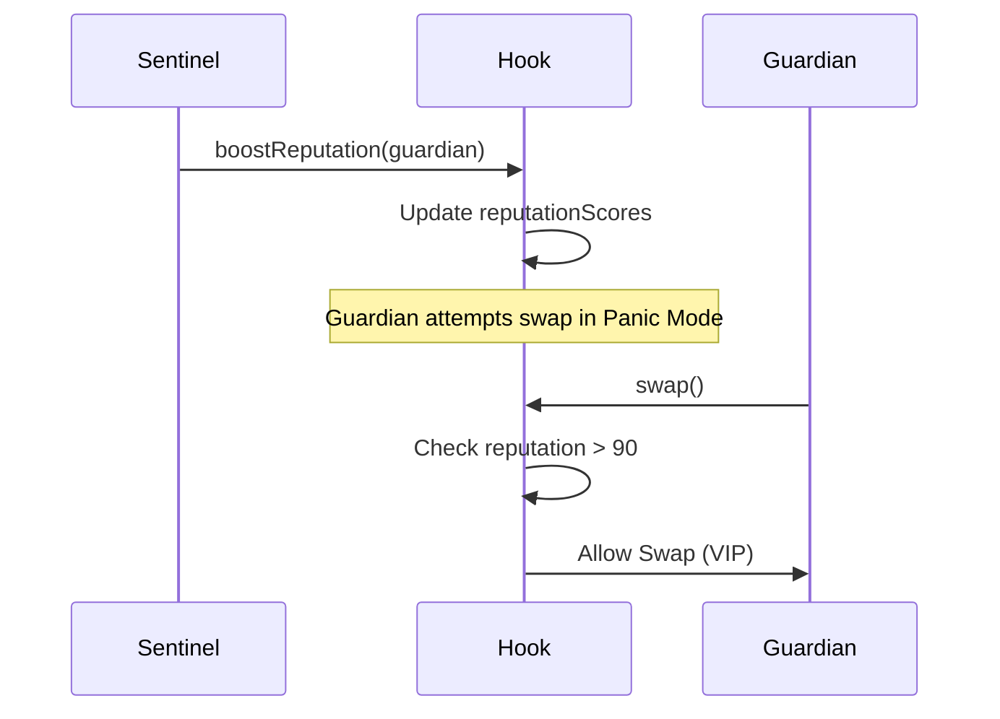

For details on the reputation system, see [AegisGuardianRegistry](/HACK3R-CRYPTO/Aegis/2.4-aegisguardianregistry).

**Sources:**[contracts/README.md52-58](https://github.com/HACK3R-CRYPTO/Aegis/blob/5ea5ecc2/contracts/README.md#L52-L58)

### Heroic Interventions

When guardians successfully protect pools, the hook can record these interventions back to the Guardian Registry on L1, creating a feedback loop for reputation building.

**Sources:**[contracts/README.md52-58](https://github.com/HACK3R-CRYPTO/Aegis/blob/5ea5ecc2/contracts/README.md#L52-L58)

## Deployment Process

### Deployment Script Flow

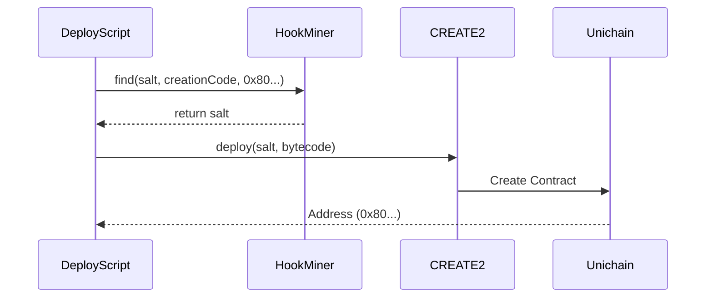

**Sources:**[contracts/README.md105-122](https://github.com/HACK3R-CRYPTO/Aegis/blob/5ea5ecc2/contracts/README.md#L105-L122)

### Constructor Parameters

The AegisHook constructor requires two parameters that are set at deployment and cannot be changed:
ParameterTypeDescriptionExample Value`poolManager``address`Reference to Uniswap v4 PoolManager`0x00B036B58a818B1BC34d502D3fE730Db729e62AC``owner``address`Initial owner address (deployer)`0xd2df53D9791e98Db221842Dd085F4144014BBE2a`
**Sources:**[contracts/broadcast/06_DeployHook.s.sol/1301/run-1769587735298.json9-12](https://github.com/HACK3R-CRYPTO/Aegis/blob/5ea5ecc2/contracts/broadcast/06_DeployHook.s.sol/1301/run-1769587735298.json#L9-L12)

## Testing and Validation

### Integration Test Coverage

The AegisHook functionality is validated through comprehensive integration tests:
Test CaseScenarioValidationStatus**Oracle Update**MockOracle price change on L1Event emission verified✅ PASS**Access Control**Unauthorized setPanicMode callReverts with proper error✅ PASS**Panic Trigger**Sentinel triggers panic modeState change confirmed✅ PASS**Circuit Breaker**Swap attempt during panicTransaction reverts with PoolPaused()✅ PASS
**Sources:**[contracts/README.md79-94](https://github.com/HACK3R-CRYPTO/Aegis/blob/5ea5ecc2/contracts/README.md#L79-L94)

### Test Execution

Tests are run using the Foundry framework:

```
forge test --match-contract AegisIntegrationTest -vv
```

**Sources:**[contracts/README.md79-82](https://github.com/HACK3R-CRYPTO/Aegis/blob/5ea5ecc2/contracts/README.md#L79-L82)

## Gas Optimization

### Minimal State Pattern

AegisHook is designed with gas efficiency in mind:

- Single boolean state variable (`panicMode`)
- No loops or unbounded arrays
- Minimal external calls during swap execution
- Optimized for the critical path (beforeSwap)

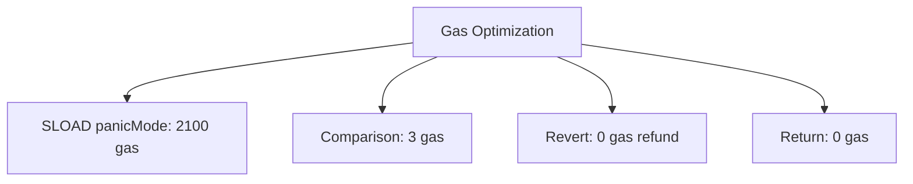

**Sources:**[contracts/README.md32-37](https://github.com/HACK3R-CRYPTO/Aegis/blob/5ea5ecc2/contracts/README.md#L32-L37)

## Error Handling

### Custom Errors

The contract uses custom errors for gas-efficient revert messages:
ErrorSignatureTrigger Condition`PoolPaused()``0x0732d7b5` (selector)Swap attempted during panic mode`Unauthorized()`CustomNon-Sentinel calls to setPanicMode
**Sources:**[contracts/README.md86-94](https://github.com/HACK3R-CRYPTO/Aegis/blob/5ea5ecc2/contracts/README.md#L86-L94)

## Production Considerations

### Mainnet Migration Path

To deploy AegisHook to production (Unichain mainnet):

1. **Replace Mock Oracle:** Update Sentinel to monitor actual Chainlink price feeds instead of MockOracle
2. **Adjust Thresholds:** Calibrate panic mode triggers based on real market conditions
3. **Multi-Sig Owner:** Transfer ownership to a multi-signature wallet for enhanced security
4. **Emergency Pause:** Implement additional safety mechanisms for extreme scenarios

**Sources:**[contracts/README.md59-69](https://github.com/HACK3R-CRYPTO/Aegis/blob/5ea5ecc2/contracts/README.md#L59-L69)

### Architecture Advantages

The design eliminates the "Inversion of Control" problem typical of keeper-based systems by making the circuit breaker autonomous and event-driven through the Reactive Network.

**Sources:**[contracts/README.md39-45](https://github.com/HACK3R-CRYPTO/Aegis/blob/5ea5ecc2/contracts/README.md#L39-L45)

## Dependencies

### External Libraries

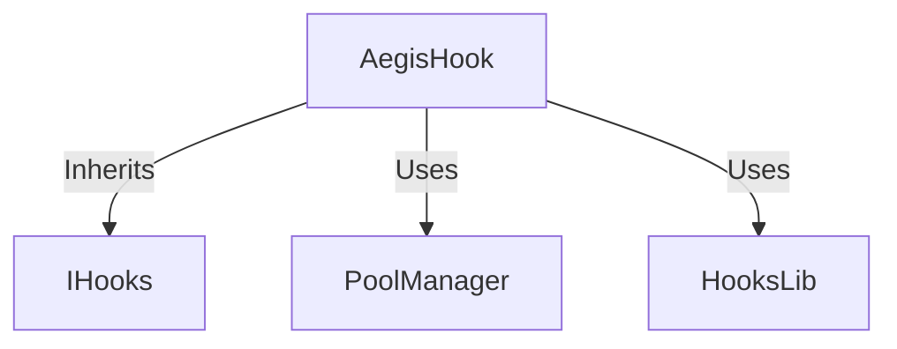

**Sources:**[contracts/README.md1-6](https://github.com/HACK3R-CRYPTO/Aegis/blob/5ea5ecc2/contracts/README.md#L1-L6)

### Git Submodules

All dependencies are managed as Git submodules and pinned to specific commits for reproducible builds. See [Git Submodules](/HACK3R-CRYPTO/Aegis/4.3-git-submodules) for initialization instructions.

**Sources:**[contracts/README.md1-6](https://github.com/HACK3R-CRYPTO/Aegis/blob/5ea5ecc2/contracts/README.md#L1-L6)

## Event System

### State Change Events

AegisHook emits events to track critical state changes for off-chain monitoring and analytics:

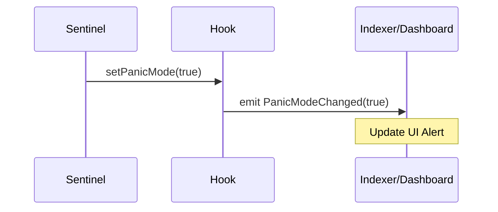

**Sources:**[contracts/README.md32-37](https://github.com/HACK3R-CRYPTO/Aegis/blob/5ea5ecc2/contracts/README.md#L32-L37)

## Deployment Addresses

### Testnet Deployments
NetworkContractAddressStatusUnichain SepoliaAegisHook`0xBaa0573e3BE4291b58083e717E9EF5051772C080`✅ ActiveUnichain SepoliaPoolManager`0x00B036B58a818B1BC34d502D3fE730Db729e62AC`✅ Active
Alternative deployment (different salt):

- AegisHook: `0x1e2ae114cf3b63779a1367ed704cca51a0218080`

**Sources:**[contracts/README.md99-103](https://github.com/HACK3R-CRYPTO/Aegis/blob/5ea5ecc2/contracts/README.md#L99-L103)[contracts/broadcast/06_DeployHook.s.sol/1301/run-latest.json7](https://github.com/HACK3R-CRYPTO/Aegis/blob/5ea5ecc2/contracts/broadcast/06_DeployHook.s.sol/1301/run-latest.json#L7-L7)