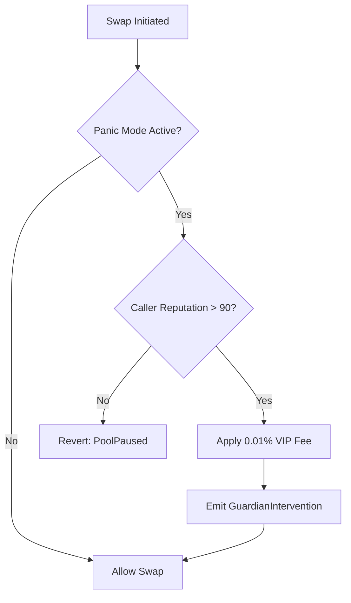
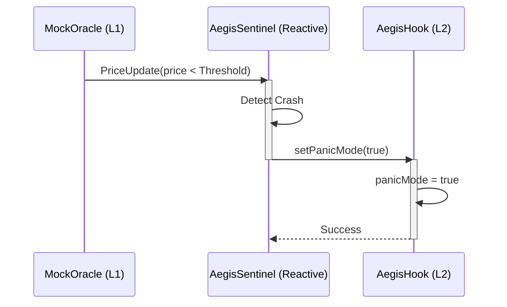

# AegisHook

## Purpose and Scope

The `AegisHook` is the Uniswap V4 Hook implementation deployed on **Unichain Sepolia** (Chain ID: 1301). It serves as the enforcement layer for the Aegis circuit breaker system, blocking liquidity pool swaps during volatile market conditions while maintaining a VIP lane for high-reputation Guardians.

This contract implements the `beforeSwap` hook interface to intercept all swap attempts on the pool it is attached to.

## Overview

The `AegisHook` operates in two distinct states:

*   **Normal Mode**: All swaps execute without restriction.
*   **Panic Mode**: Only high-reputation Guardians (reputation > 90) can execute swaps. Standard traders are blocked.

The contract logic is controlled by the `AegisSentinel` contract via cross-chain calls, responding to market volatility events detected on L1.

```mermaid
stateDiagram-v2
    [*] --> NormalMode
    
    state NormalMode {
        [*] --> AllowAllSwaps
        AllowAllSwaps --> PanicMode: setPanicMode(true)
    }
    
    state PanicMode {
        [*] --> CheckReputation
        CheckReputation --> BlockSwap: Rep <= 90
        CheckReputation --> AllowVIPSwap: Rep > 90
        AllowVIPSwap --> LogIntervention
        BlockSwap --> [*]
        LogIntervention --> [*]
        
        PanicMode --> NormalMode: setPanicMode(false)
    }
```

## Deployment Details

### CREATE2 Deployment

The contract makes use of **CREATE2** deployment to generate a deterministic address with specific flags required by Uniswap V4.

| Property | Value |
| --- | --- |
| **Network** | Unichain Sepolia (Chain ID: 1301) |
| **Address** | `0x1E2aE114cF3B63779A1367eD704ccA51a0218080` |
| **Flags** | `...8080` (Binary `1000...`) |
| **Deployer** | Deterministic Proxy |

### Address Flag Requirements

Uniswap V4 requires hook addresses to have specific bit prefixes to indicate which callbacks they support. `AegisHook` implements `beforeSwap`, so its address must satisfy a specific mask (ending in `0x80`). This was achieved by mining a salt during deployment.

## Core Functionality

### `beforeSwap` Hook Logic

The `beforeSwap` function is the gatekeeper for the liquidity pool. Its logic flow is as follows:



### Panic Mode State Management

The contract maintains a boolean state `panicMode`.

*   **Activated by**: `setPanicMode(true)` - called by `AegisSentinel` (or authorized relayer).
*   **Effect**: Blocks all swaps from non-VIP addresses.

### VIP Lane Implementation

The "VIP Lane" allows high-reputation Guardians to trade even when the pool is paused for everyone else. This is critical for:
1.  **Liquidity Provision**: Allowing trusted entities to rebalance the pool.
2.  **Market Stabilization**: Preventing total liquidity freeze-up during crashes.

**VIP Conditions**:
*   Address must be registered in the Guardian Registry (synced from L1).
*   Reputation score must be strictly greater than 90.

## Access Control

The contract enforces strict access control on its administrative functions:

| Function | Access Modifier | Allowed Caller |
| --- | --- | --- |
| `setPanicMode(bool)` | `onlySentinel` | `AegisSentinel` |
| `updateReputation(...)` | `onlySentinel` | `AegisSentinel` |
| `beforeSwap(...)` | `onlyPoolManager` | Uniswap V4 `PoolManager` |
| `transferOwnership(...)` | `onlyOwner` | Contract Owner |

## Integration Points

### Cross-Chain Communication

The `AegisHook` is the destination for cross-chain messages originating from the `AegisSentinel` on Reactive Network.



## Storage Layout

To optimize gas, the contract uses a packed storage layout and caches reputation scores locally.

*   **`panicMode` (bool)**: Occupies a single byte.
*   **`guardianReputation` (mapping)**: Maps addresses to their L1 reputation score (synced via cross-chain messages).
*   **`poolManager` (immutable)**: The address of the Uniswap V4 PoolManager.
*   **`SENTINEL_ADDRESS` (immutable)**: The address of the authorized Sentinel contract.

## Events

*   `PanicModeSet(bool enabled)`: Emitted when the circuit breaker state changes.
*   `GuardianIntervention(address guardian, uint256 volume)`: Emitted when a VIP swap is executed during panic mode.
*   `ReputationUpdated(address guardian, uint256 newScore)`: Emitted when a reputation score is synced from L1.