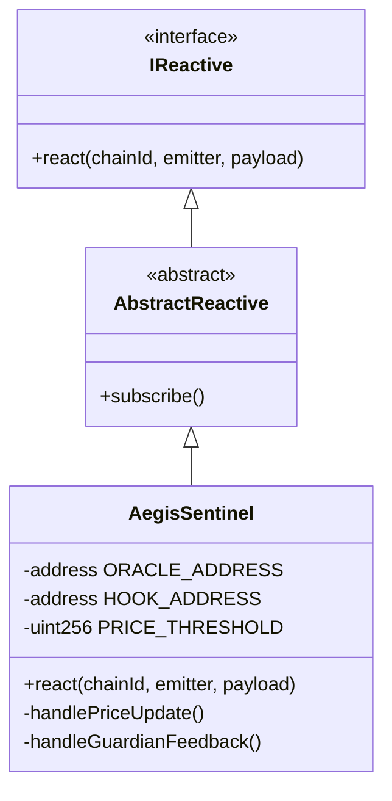

# AegisSentinel

## Purpose and Scope

The `AegisSentinel` is a smart contract deployed on the **Reactive Network** (Lasna testnet) that acts as the autonomous "brain" of the Aegis system. It listens for cryptic events on one chain (Ethereum Sepolia) and triggers defensive actions on another chain (Unichain Sepolia).

This document covers the Sentinel's reactive architecture, event processing logic, and cross-chain message dispatching.

## Overview

Unlike traditional smart contracts that sit dormant until called, `AegisSentinel` is a **Reactive Smart Contract**. It automatically executes logic in response to events emitted by other contracts on supported chains.

*   **Location**: Reactive Network (Chain ID: 5318007)
*   **Role**: Cross-chain orchestrator
*   **Triggers**: `PriceUpdate` (from L1), `NewFeedback` (from L1)
*   **Actions**: `setPanicMode` (on L2), `boostReputation` (on L2)

## System Integration

The Sentinel sits in the middle of the Aegis architecture, bridging the gap between L1 data and L2 execution.

```mermaid
graph LR
    Oracle[MockOracle (L1)] -- PriceUpdate --> Sentinel[AegisSentinel (Reactive)]
    Registry[GuardianRegistry (L1)] -- NewFeedback --> Sentinel
    
    Sentinel -- setPanicMode --> Hook[AegisHook (L2)]
    Sentinel -- boostReputation --> Hook
```

## Contract Architecture

### Inheritance

The contract extends `AbstractReactive` from the Reactive Network SDK.



### Constructor and Initialization

The Sentinel is initialized with the addresses of the contracts it interacts with:

```solidity
constructor(
    address _systemContract, // Reactive Network System
    address _oracleAddress,  // L1 Oracle
    address _hookAddress     // L2 Hook
)
```

After deployment, the contract must **subscribe** to events using the Reactive Network's system calls. This is typically done via a script or manual transaction to `subscribe()`.

## Event Reaction Mechanism

The core logic resides in the `react()` function, which defines how the Sentinel responds to incoming events.

### Price Crash Detection

The Sentinel monitors the `PriceUpdate` event from the `MockOracle`.

**Algorithm**:
1.  Decode the `newPrice` from the event payload.
2.  Compare `newPrice` against `PRICE_THRESHOLD`.
3.  If `newPrice < PRICE_THRESHOLD`:
    *   Construct a cross-chain calldata for `AegisHook.setPanicMode(true)`.
    *   Dispatch the transaction to Unichain.
4.  If `newPrice >= PRICE_THRESHOLD` (and panic was active):
    *   Recall `setPanicMode(false)` to lift restrictions.

```mermaid
flowchart TD
    Event[PriceUpdate Event] --> Decode[Decode Check Price]
    Decode --> Check{Price < Threshold?}
    
    Check -- Yes --> Panic[Trigger Panic Mode]
    Check -- No --> Normal[Ensure Normal Mode]
    
    Panic --> Dispatch[Send setPanicMode(true) to L2]
    Normal --> Dispatch2[Send setPanicMode(false) to L2]
```

## Cross-Chain Message Dispatch

The Sentinel essentially acts as an automated relayer. When it decides an action is needed, it encodes a standard EVM function call and instructs the Reactive Network to execute it on the destination chain.

**Example Payload (Panic Activation):**
```solidity
bytes memory payload = abi.encodeWithSignature("setPanicMode(bool)", true);
emit Callback(1301, HOOK_ADDRESS, 0, payload); // 1301 = Unichain L2
```

## Integration Points

### Oracle Integration
The Sentinel subscribes to `PriceUpdate(uint256)` from the `MockOracle` on Sepolia (Chain ID 11155111).

### Hook Integration
The Sentinel exerts control over the `AegisHook` on Unichain (Chain ID 1301). The Hook allows calls from the Sentinel address to toggle panic mode or update reputation.

### Registry Integration
The Sentinel subscribes to `NewFeedback(address)` from the `GuardianRegistry`. When a Guardian performs a verifiable action on L1 (via the Registry), the Sentinel relays a reputation boost to their L2 profile on the Hook.

## Operational Constraints

1.  **Latency**: Cross-chain reactions are not instantaneous. There is a delay comprising:
    *   L1 Block confirmation.
    *   Reactive Network processing.
    *   L2 Message delivery.
    Total latency is typically 15-30 seconds.
    
2.  **Gas Costs**: The Reactive Network subsidizes the `react()` execution, but the contract must be deployed with sufficient gas to handle initial setup.

3.  **Oracle Dependency**: The current implementation relies on a single `MockOracle`. A production version would subscribe to a Chainlink Aggregator or similar decentralized feed.