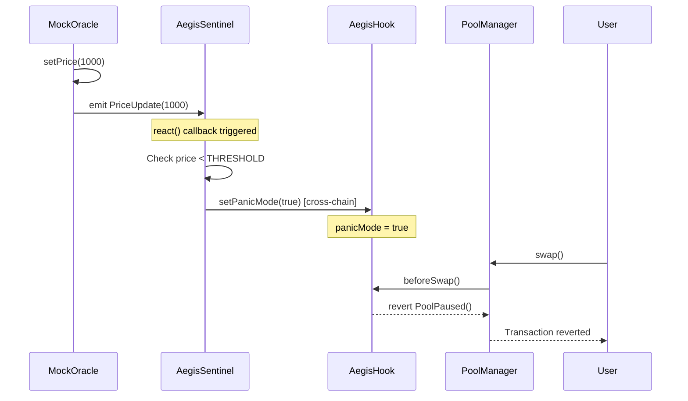
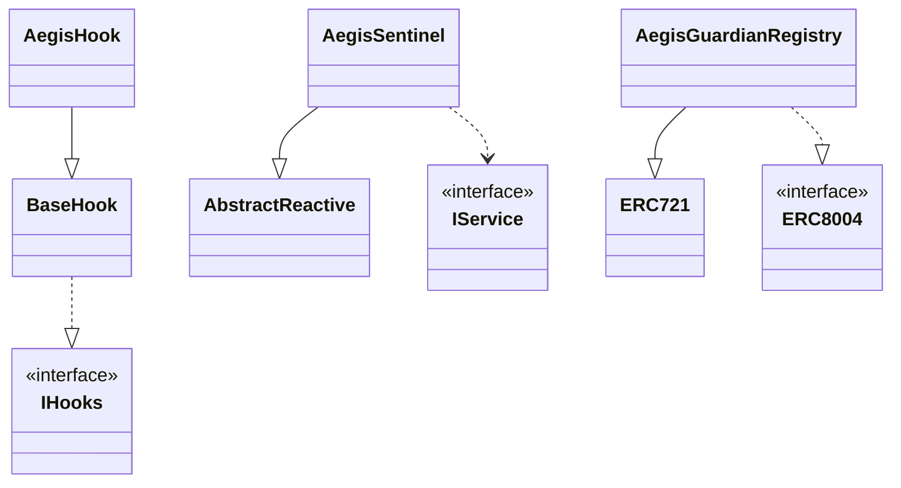

# Core Smart Contracts

The Aegis system is composed of four core smart contracts that work together across three blockchain networks to implement a cross-chain circuit breaker for Uniswap v4 pools. This page introduces each contract, their roles, and how they interact.

For detailed implementation documentation of individual contracts, see:

- [AegisHook](./AegisHook.md) - Uniswap v4 hook implementation
- [AegisSentinel](./AegisSentinel.md) - Reactive Network listener contract
- [MockOracle](./MockOracle.md) - Price feed simulator
- [Guardian Registry](./Guardian-Registry.md) - Reputation system implementation

For deployment procedures, see [Deployment](./Deployment.md). For development setup and testing, see [Development Guide](./Development-Guide.md).

## The Four Core Contracts

Aegis consists of four smart contracts deployed across three blockchain networks. Each contract has a specific role in the circuit breaker system.

| Contract | File Path | Network | Role |
| :--- | :--- | :--- | :--- |
| **MockOracle** | `src/MockOracle.sol` | Ethereum Sepolia (11155111) | Price feed simulator that emits `PriceUpdate` events |
| **AegisSentinel** | `src/AegisSentinel.sol` | Reactive Lasna (5318007) | Cross-chain orchestrator that monitors L1 events and triggers L2 actions |
| **AegisHook** | `src/AegisHook.sol` | Unichain Sepolia (1301) | Uniswap v4 hook that implements the `beforeSwap` circuit breaker |
| **AegisGuardianRegistry** | `src/AegisGuardianRegistry.sol` | Ethereum Sepolia (11155111) | ERC-721 + ERC-8004 contract for Guardian identity and reputation |

### Contract Roles

- **MockOracle**: Acts as the trigger source on L1. It simulates a Chainlink price feed by allowing manual price updates via `setPrice(uint256)` and emitting `PriceUpdate(uint256)` events that the Sentinel monitors.

- **AegisSentinel**: Serves as the autonomous watchdog on the Reactive Network. It subscribes to events from `MockOracle` and `AegisGuardianRegistry` on L1, evaluates conditions, and sends cross-chain messages to `AegisHook` on L2 to activate or deactivate panic mode.

- **AegisHook**: The enforcement layer on Unichain. It implements Uniswap v4's `IHooks` interface and controls swap execution through its `beforeSwap()` function. When `panicMode` is true, all regular swaps revert with the `PoolPaused()` error.

- **AegisGuardianRegistry**: Maintains the identity and reputation system for Guardians who can provide liquidity during panic mode. It implements ERC-721 for identity NFTs and ERC-8004 for trustless agent feedback.

## Contract Interaction Flow

### Diagram: Circuit Breaker Activation Sequence



This sequence shows how the four contracts coordinate during a market crash. The `MockOracle.setPrice()` function triggers a `PriceUpdate` event that the `AegisSentinel` receives through the Reactive Network's subscription system. The Sentinel's `react()` callback evaluates the price against a hardcoded `THRESHOLD` and sends a cross-chain message to call `AegisHook.setPanicMode(true)`. Subsequently, when users attempt to swap, the `PoolManager` invokes `AegisHook.beforeSwap()`, which reverts if `panicMode` is active.

## Key Code Entities

The following table maps system concepts to specific code entities (functions, events, state variables) that can be searched in the codebase.

### Functions

| Function | Contract | Visibility | Description |
| :--- | :--- | :--- | :--- |
| `setPrice(uint256 newPrice)` | `MockOracle` | `external` | Updates the price and emits `PriceUpdate` event |
| `setPanicMode(bool _panic)` | `AegisHook` | `external` | Activates/deactivates circuit breaker (only callable by `SENTINEL_ADDRESS`) |
| `beforeSwap(...)` | `AegisHook` | `public` | Hook callback invoked by `PoolManager` before each swap |
| `react(...)` | `AegisSentinel` | `internal` | Reactive Network callback that processes subscribed events |

### Events

| Event | Contract | Signature | Purpose |
| :--- | :--- | :--- | :--- |
| `PriceUpdate` | `MockOracle` | `event PriceUpdate(uint256 newPrice)` | Signals L1 price changes |
| `PanicModeSet` | `AegisHook` | `event PanicModeSet(bool isPanic)` | Logs circuit breaker state changes |
| `NewFeedback` | `AegisGuardianRegistry` | `event NewFeedback(...)` | Records Guardian intervention feedback |

### State Variables

| Variable | Contract | Type | Description |
| :--- | :--- | :--- | :--- |
| `panicMode` | `AegisHook` | `bool` | Circuit breaker activation state |
| `SENTINEL_ADDRESS` | `AegisHook` | `address` (immutable) | Address authorized to call `setPanicMode` |
| `THRESHOLD` | `AegisSentinel` | `uint256` (constant) | Price threshold for panic activation |
| `currentPrice` | `MockOracle` | `uint256` | Latest price value |

## Multi-Chain Deployment Architecture

### Diagram: Contract Deployment Topology

```mermaid
graph TD
    subgraph L1 [Ethereum Sepolia (11155111)]
        Oracle[MockOracle]
        Registry[AegisGuardianRegistry]
    end
    
    subgraph Reactive [Reactive Network Lasna (5318007)]
        Sentinel[AegisSentinel]
    end
    
    subgraph Unichain [Unichain Sepolia (1301)]
        Hook[AegisHook]
        Pool[PoolManager]
    end

    Oracle -->|Events| Sentinel
    Registry -->|Events| Sentinel
    Sentinel -->|Cross-chain Calls| Hook
    Hook -->|Gating| Pool
```

The contracts are distributed across three networks to leverage each chain's unique capabilities:

- **Ethereum Sepolia (L1)**: Hosts `MockOracle` and `AegisGuardianRegistry` as the source of truth for price data and Guardian identity/reputation.
- **Reactive Network Lasna**: Runs `AegisSentinel`, which provides autonomous event monitoring without requiring off-chain keeper infrastructure.
- **Unichain Sepolia (L2)**: Deploys `AegisHook` alongside Uniswap v4's `PoolManager` for fast swap protection using 250ms Flashblocks.

## Contract Dependencies

### Diagram: Inheritance and External Dependencies



### Dependency Details

- **AegisHook**: Implements Uniswap v4's `IHooks` interface from the `v4-core` library. It inherits from `BaseHook` to get standardized hook callback stubs and helper functions.
- **AegisSentinel**: Extends `AbstractReactive` from the `reactive-lib` library. This base contract provides the `react()` callback mechanism and cross-chain messaging utilities required for the Reactive Network.
- **AegisGuardianRegistry**: Implements both ERC-721 (for NFT-based identity) and ERC-8004 (for trustless agent feedback). This dual implementation enables Guardians to receive reputation updates as immutable on-chain feedback.
- **MockOracle**: A standalone contract with no external dependencies beyond standard Solidity primitives.

## Access Control Patterns

The Aegis system implements strict access control to prevent unauthorized manipulation of the circuit breaker.

| Contract | Protected Function | Access Control | Enforced By |
| :--- | :--- | :--- | :--- |
| `AegisHook` | `setPanicMode(bool)` | Only `SENTINEL_ADDRESS` | `require(msg.sender == SENTINEL_ADDRESS)` |
| `AegisSentinel` | `react(...)` | Only Reactive Network system | Enforced by `AbstractReactive` base contract |
| `MockOracle` | `setPrice(uint256)` | No restriction (testnet only) | N/A - production uses Chainlink |

The most critical access control is in `AegisHook.setPanicMode()`, which can only be called by the `SENTINEL_ADDRESS`. This immutable address is set during deployment and points to the `AegisSentinel` contract on the Reactive Network.

## Design Philosophy

The Aegis smart contract architecture adheres to several key principles:

1.  **Event-Driven Design**: All cross-chain coordination is triggered by on-chain events, eliminating the need for centralized monitoring bots.
2.  **Interface Agnostic**: The `AegisSentinel` listens for the standard `PriceUpdate(uint256)` event signature. In production, `MockOracle` can be replaced with a Chainlink oracle address without any code changes to the Sentinel logic.
3.  **Deterministic Testing**: The `MockOracle` contract allows for reproducible demonstrations of circuit breaker activation during market crash simulations.
4.  **Access Control**: The `AegisHook` enforces strict access control—only the `SENTINEL_ADDRESS` can modify `panicMode`, preventing unauthorized manipulation.
5.  **Minimal Trust Assumptions**: The system requires trust only in the oracle data source (Chainlink in production) and the Reactive Network's cross-chain messaging reliability.