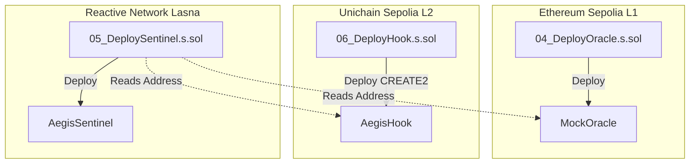
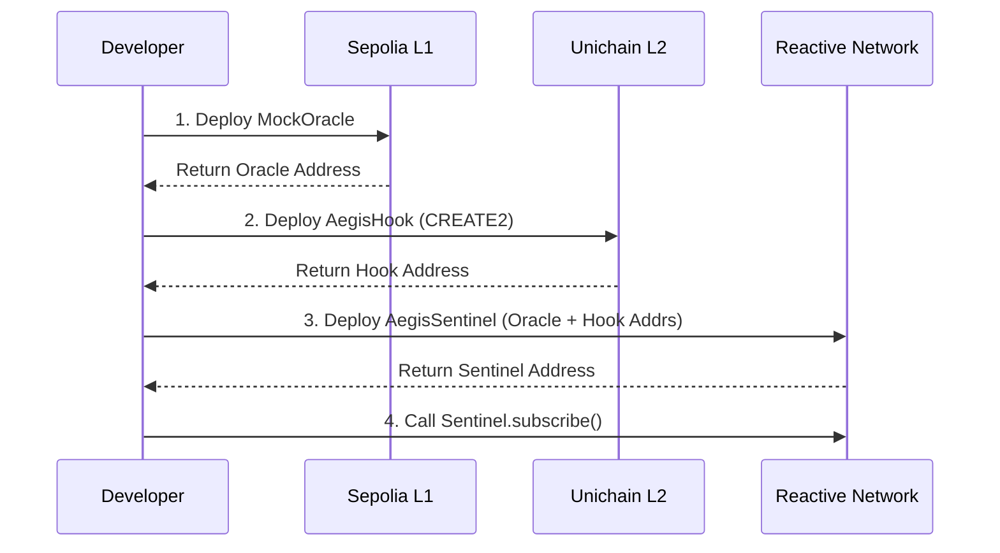

# Deployment Scripts

## Purpose and Scope

This document provides technical reference for the Foundry deployment scripts used to deploy Aegis contracts across three blockchain networks: Ethereum Sepolia (L1), Reactive Network (Lasna), and Unichain Sepolia (L2). The deployment process is a critical multi-chain orchestration that must be executed in a specific sequence to establish proper cross-chain communication channels.

## Overview

Aegis uses three Foundry Solidity scripts located in the `contracts/script/` directory to deploy its core contracts. These scripts leverage Foundry's `forge script` command to deterministically deploy contracts while generating detailed broadcast logs for auditability.

### Deployment Scripts Summary

| Script                  | Network               | Contract      | Transaction Type | Special Flags          |
| :---------------------- | :-------------------- | :------------ | :--------------- | :--------------------- |
| `04_DeployOracle.s.sol` | Sepolia (L1)          | MockOracle    | CREATE           | None                   |
| `05_DeploySentinel.s.sol` | Reactive Lasna        | AegisSentinel | CREATE           | `--legacy`             |
| `06_DeployHook.s.sol`   | Unichain Sepolia (L2) | AegisHook     | CREATE2          | Salt mining required   |

## Deployment Architecture



## Script 1: Oracle Deployment (`04_DeployOracle.s.sol`)

### Purpose
Deploys the `MockOracle` contract to Ethereum Sepolia (L1), which acts as the price feed source that triggers the cross-chain circuit breaker mechanism.

### Deployment Command
```bash
forge script script/04_DeployOracle.s.sol --rpc-url sepolia --broadcast
```

### Transaction Details
The deployment uses a standard `CREATE` opcode transaction.
*   **Contract Name**: `MockOracle`
*   **Network**: Ethereum Sepolia (Chain ID: 11155111)

## Script 2: Hook Deployment (`06_DeployHook.s.sol`)

### Purpose
Deploys the `AegisHook` contract to Unichain Sepolia (L2) using `CREATE2` with deterministic address generation. The hook implements the Uniswap v4 `beforeSwap` circuit breaker mechanism.

### Deployment Command
```bash
forge script script/06_DeployHook.s.sol --rpc-url unichain_sepolia --broadcast
```

### CREATE2 Deployment Strategy
Unlike the other two contracts, `AegisHook` uses the `CREATE2` opcode for deployment. This is required for Uniswap v4 hooks because the hook address must have specific flag bits set to indicate which callback functions it implements.

## Script 3: Sentinel Deployment (`05_DeploySentinel.s.sol`)

### Purpose
Deploys the `AegisSentinel` contract to the Reactive Network (Lasna), which acts as the autonomous cross-chain orchestrator that listens to L1 events and triggers L2 actions.

### Deployment Command
```bash
forge script script/05_DeploySentinel.s.sol --rpc-url reactive --broadcast --legacy
```

### Special Considerations
*   **Legacy Transaction Flag**: The `--legacy` flag is required for Reactive Network deployment. This forces Foundry to use legacy (non-EIP-1559) transactions.
*   **Post-Deployment Subscription**: After deployment, the Sentinel contract requires a manual subscription call to start listening to L1 events.

### Constructor Arguments
The `AegisSentinel` constructor receives three critical addresses:
```solidity
constructor(
    address _reactiveServiceAddress,  // Reactive Network system contract
    address _hook,                    // AegisHook address on Unichain L2
    address _priceOracle              // MockOracle address on Sepolia L1
)
```

## Deployment Workflow



## Special Deployment Considerations

### Network-Specific Requirements
*   **Reactive Network**: `--legacy` flag required (No EIP-1559).
*   **Unichain**: `CREATE2` with salt mining required for Hook address permissions.

### Gas Considerations
The Hook deployment on Unichain is the most expensive due to L1 data availability costs (blob gas).

### Post-Deployment Actions
1.  **Subscribe Sentinel to Oracle Events**: Call `AegisSentinel.subscribe()` on Reactive Network.
2.  **Verify Cross-Chain Communication**: Test that Oracle price updates trigger Sentinel reactions.
3.  **Initialize Pool with Hook**: Deploy a Uniswap v4 pool on Unichain that references the deployed Hook address.