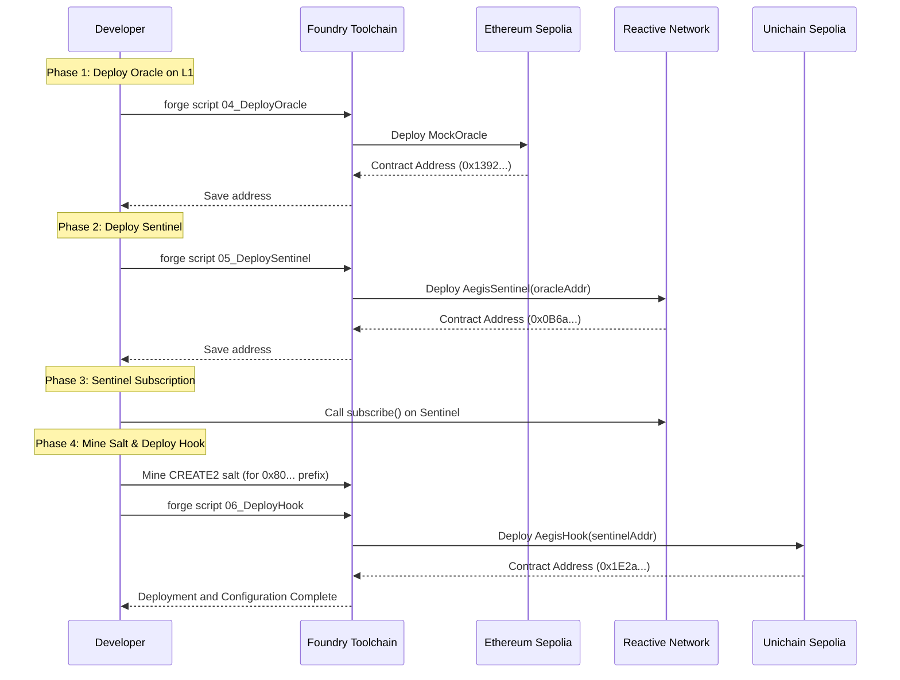
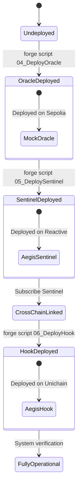

# Deployment

## Purpose and Scope

This document provides a comprehensive guide for deploying the Aegis cross-chain circuit breaker system across three blockchain networks: Ethereum Sepolia (L1), Reactive Network Lasna, and Unichain Sepolia (L2). The deployment process requires executing multiple Foundry scripts in a specific order, with cross-chain configuration dependencies between contracts.

For detailed information about individual deployment scripts, see [Deployment Scripts](./Deployment-Scripts.md). For network-specific RPC endpoints and chain IDs, see [Network Configuration](./Network-Configuration.md).

---

## Deployment Architecture

The Aegis system consists of four smart contracts deployed across three separate blockchain networks. Each network serves a distinct architectural role in the cross-chain circuit breaker mechanism.

```mermaid
graph TD
    subgraph L1 [Ethereum Sepolia (Chain 11155111)]
        Oracle[MockOracle: 0x1392...a7D8]
        Registry[GuardianRegistry]
    end

    subgraph Reactive [Reactive Network Lasna (Chain 5318007)]
        Sentinel[AegisSentinel: 0x0B6a...b6B6]
    end

    subgraph L2 [Unichain Sepolia (Chain 1301)]
        Hook[AegisHook: 0x1E2a...8080]
    end

    Oracle -->|PriceUpdate Event| Sentinel
    Registry -->|NewFeedback Event| Sentinel
    Sentinel -->|setPanicMode()| Hook
```

| Network | Chain ID | Contract | Role |
| --- | --- | --- | --- |
| **Ethereum Sepolia** | 11155111 | `MockOracle` | Emits `PriceUpdate` events |
| **Ethereum Sepolia** | 11155111 | `GuardianRegistry` | Future: ERC-721 + ERC-8004 Reputation state |
| **Reactive Network** | 5318007 | `AegisSentinel` | Listens to L1 events, triggers L2 actions |
| **Unichain Sepolia** | 1301 | `AegisHook` | Enforces circuit breaker rules |

---

## Deployment Order and Dependencies

The deployment process must follow a strict sequential order due to cross-contract dependencies. Each contract requires configuration data from previously deployed contracts.

| Step | Contract | Network | Script | Dependencies |
| --- | --- | --- | --- | --- |
| 1 | `MockOracle` | Ethereum Sepolia | `04_DeployOracle.s.sol` | None |
| 2 | `AegisSentinel` | Reactive Lasna | `05_DeploySentinel.s.sol` | Oracle address from Step 1 |
| 3 | `AegisHook` | Unichain Sepolia | `06_DeployHook.s.sol` | Sentinel address from Step 2 |

### Critical Deployment Constraints

1.  **Oracle-First Requirement**: `AegisSentinel` constructor requires the deployed `MockOracle` address to configure event subscription parameters via `subscribe()` method.
2.  **Sentinel Address for Hook**: `AegisHook` constructor requires the deployed `AegisSentinel` address to restrict `setPanicMode()` access control using the `onlySentinel` modifier.
3.  **CREATE2 Salt Mining**: `AegisHook` deployment requires a pre-computed salt value to ensure the deployed address has the `BEFORE_SWAP_FLAG` (0x80...) required by Uniswap V4 pool manager hook validation.

---

## Deployment Workflow

The following sequence diagram illustrates the complete deployment workflow, including cross-network contract instantiation and post-deployment configuration steps.



---

## Foundry Script Execution

Each deployment script is executed using the `forge script` command with network-specific parameters.

### Oracle Deployment (Step 1)

```bash
forge script script/04_DeployOracle.s.sol \
  --rpc-url sepolia \
  --broadcast \
  --verify
```

**Script Functionality:**
- Deploys `MockOracle` contract to Ethereum Sepolia.
- Outputs deployment address to `broadcast/04_DeployOracle.s.sol/11155111/run-latest.json`.

### Sentinel Deployment (Step 2)

```bash
forge script script/05_DeploySentinel.s.sol \
  --rpc-url reactive \
  --broadcast \
  --legacy
```

**Script Functionality:**
- Deploys `AegisSentinel` to Reactive Network Lasna.
- Constructor requires: `chainId` (11155111), `oracleAddress` (from Step 1).
- Requires `--legacy` flag due to Reactive Network EVM compatibility.
- Requires manual `subscribe()` call post-deployment to activate event listening.

### Hook Deployment (Step 3)

```bash
forge script script/06_DeployHook.s.sol \
  --rpc-url unichain_sepolia \
  --broadcast \
  --verify
```

**Script Functionality:**
- Deploys `AegisHook` to Unichain Sepolia using CREATE2.
- Constructor requires: `poolManager` address, `sentinelAddress` (from Step 2).
- Uses pre-computed salt to achieve hook address with `BEFORE_SWAP_FLAG` prefix.

---

## Network Configuration Requirements

The deployment process requires properly configured RPC endpoints and private keys for all three networks. These are specified in `foundry.toml`.

| Network | Chain ID | RPC Configuration Key | Required for |
| --- | --- | --- | --- |
| Ethereum Sepolia | 11155111 | `sepolia` | Oracle deployment |
| Reactive Lasna | 5318007 | `reactive` | Sentinel deployment |
| Unichain Sepolia | 1301 | `unichain_sepolia` | Hook deployment |

**Environment Variables:**
- `PRIVATE_KEY`: Deployer account private key (must have native tokens on all networks).
- `ETHERSCAN_API_KEY`: For contract verification on Sepolia.

---

## Post-Deployment Configuration

After all contracts are deployed, additional configuration steps are required to activate the cross-chain system.

### Sentinel Event Subscription

The `AegisSentinel` contract must be manually configured to listen for `PriceUpdate` events from the deployed `MockOracle`:

```bash
cast send 0x0B6ae13119Fc3b61d6ABb115342A1A075e14b6B6 \
  "subscribe()" \
  --rpc-url reactive \
  --private-key $PRIVATE_KEY
```

This call registers the Sentinel with the Reactive Network's event subscription system, establishing the L1→Reactive event bridge.

### Verification of Cross-Chain Linkage

1.  **Oracle→Sentinel**: Confirm Sentinel is subscribed to Oracle events.
2.  **Sentinel→Hook**: Confirm Hook's `authorizedSentinel` matches deployed Sentinel address.
3.  **Hook Address**: Confirm Hook address satisfies `BEFORE_SWAP_FLAG` (0x80...).

---

## Deployment Output Artifacts

Each deployment script generates a broadcast log JSON file containing complete transaction metadata. These files are stored in `broadcast/<ScriptName>/<ChainID>/run-latest.json` and include:
- Deployed contract addresses
- Constructor arguments
- Transaction hashes
- Gas usage statistics
- Block numbers and timestamps
- Contract ABI and bytecode

---

## Deployment State Diagram

