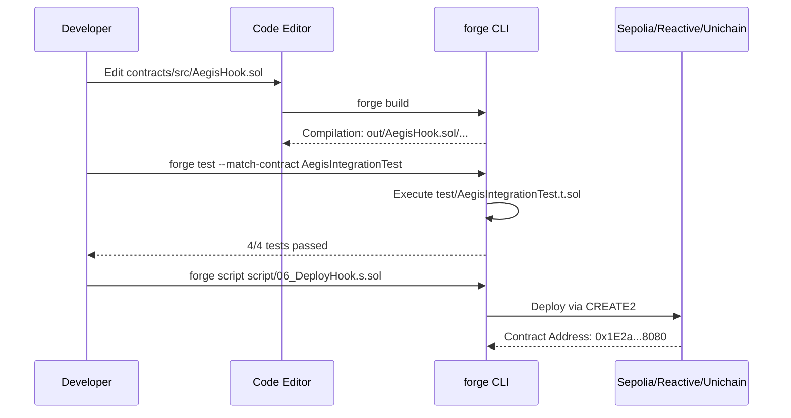
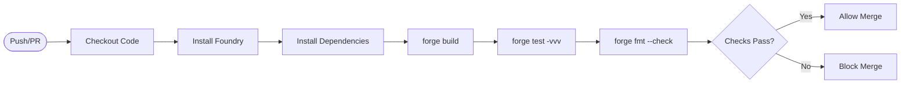

# Development Guide

This document provides instructions for setting up a local development environment for Aegis, building the smart contracts, running tests, and understanding the development workflow. This guide covers the prerequisites, quick start process, and the development loop for contributors working on the Aegis codebase.

For detailed information on the monorepo structure, see [Project Structure](./Project-Structure.md). For dependency management, see [Dependencies and Submodules](./Dependencies-and-Submodules.md).

---

## Prerequisites

The Aegis development environment requires the following tools:

| Tool | Purpose | Installation |
| --- | --- | --- |
| **Foundry** | Solidity compilation, testing, deployment | `curl -L https://foundry.paradigm.xyz \| bash && foundryup` |
| **Git** | Version control with submodules | Standard package manager |
| **Node.js** | Frontend development (optional) | v18+ recommended |

The core contract development uses Foundry exclusively. The Solidity compiler version is `0.8.26` with Cancun EVM features enabled. All source contracts are located in `contracts/src/`.

---

## Environment Setup

### 1. Clone Repository

```bash
git clone https://github.com/HACK3R-CRYPTO/Aegis
cd Aegis
```

### 2. Initialize Submodules

Aegis uses Git submodules for external dependencies. Initialize them:

```bash
git submodule update --init --recursive
```

This fetches the following critical dependencies:

- `lib/system-smart-contracts` - Reactive Network SDK for `AbstractReactive` base class
- `lib/uniswap-hooks` - Uniswap v4 core interfaces and periphery contracts
- `lib/forge-std` - Foundry standard testing library (`Test`, `console2`, `Vm`)

### 3. Configure Environment Variables

Create a `.env` file in the `contracts/` directory.

Required variables for deployment scripts:

```ini
# Private key for deployment transactions
PRIVATE_KEY=0x...
 
# RPC endpoints (if not using foundry.toml defaults)
SEPOLIA_RPC_URL=https://eth-sepolia.g.alchemy.com/v2/...
REACTIVE_RPC_URL=https://lasna-rpc.rnk.dev/
UNICHAIN_RPC_URL=https://unichain-sepolia-rpc.publicnode.com
 
# Optional: Etherscan API keys for verification
ETHERSCAN_API_KEY=...
```

**Security Note:** Never commit private keys. The `.gitignore` configuration ensures environment files are excluded from Git tracking.

---

## Quick Start Workflow

The development workflow follows a standard edit-build-test cycle:

```mermaid
flowchart TD
    Start([Start]) --> Edit[Edit Contracts src/*.sol]
    Edit --> Build[forge build]
    Build --> Test[forge test]
    Test --> Pass{Tests Pass?}
    Pass -->|No| Debug[Debug Failures]
    Debug --> Edit
    Pass -->|Yes| Deploy[Deploy (Optional)]
    Deploy --> Complete([Complete])
```

### Build Contracts

Navigate to the contracts directory and compile:

```bash
cd contracts
forge build
```

This compiles all contracts in `contracts/src/` and outputs artifacts to `contracts/out/`. Build artifacts are excluded from version control.

**Compiler Settings:** The build uses `via_ir = true` for optimizer improvements, which is required for complex contracts like `AegisHook.sol` that integrate Uniswap v4 hooks.

### Run Tests

Execute the test suite:

```bash
forge test -vv
```

For specific test contracts (e.g., `test/AegisIntegrationTest.t.sol`):

```bash
forge test --match-contract AegisIntegrationTest -vv
```

The `-vv` flag provides verbose output showing function calls and events.

---

## Development Loop

### Typical Development Session

The standard development cycle for modifying Aegis smart contracts:



### File System Organization

The repository follows a monorepo structure with source contracts, tests, and deployment scripts separated:

```
Aegis/
├── contracts/
│   ├── src/
│   │   ├── AegisHook.sol           # Uniswap v4 Hook
│   │   ├── AegisSentinel.sol       # Reactive Contract
│   │   ├── MockOracle.sol          # Price Feed Simulator
│   │   └── AegisGuardianRegistry.sol # ERC-721 + ERC-8004
│   ├── test/
│   │   └── AegisIntegrationTest.t.sol # Cross-chain Tests
│   ├── script/
│   │   ├── 04_DeployOracle.s.sol   # Sepolia Deployment
│   │   ├── 05_DeploySentinel.s.sol # Reactive Deployment
│   │   └── 06_DeployHook.s.sol     # Unichain Deployment
│   ├── lib/
│   │   ├── forge-std/
│   │   ├── uniswap-hooks/
│   │   └── system-smart-contracts/
│   ├── foundry.toml
│   └── broadcast/ (ignored)
├── frontend/
├── .gitignore
└── .gitmodules
```

### Build Artifacts

The Foundry build system generates several output directories:

| Directory | Purpose | Contents | Version Control |
| --- | --- | --- | --- |
| `contracts/out/` | Compiled bytecode and ABIs | `*.sol/*.json` files | Excluded |
| `contracts/cache/` | Compiler cache | Solidity compiler cache | Excluded |
| `contracts/broadcast/` | Deployment logs | `<script>/<chainId>/run-latest.json` | Excluded |

These directories are automatically created during `forge build` and should not be committed.

---

## Contract Remappings

Foundry uses remappings defined in `foundry.toml` to resolve imports from external libraries:

```toml
reactive-lib/=lib/system-smart-contracts/lib/reactive-lib/src/
system-smart-contracts/=lib/system-smart-contracts/src/
v4-core/=lib/uniswap-hooks/lib/v4-core/
v4-periphery/=lib/uniswap-hooks/lib/v4-periphery/
```

**Example Usage in `AegisSentinel.sol`:**
```solidity
import {AbstractReactive} from "system-smart-contracts/AbstractReactive.sol";
```

**Example Usage in `AegisHook.sol`:**
```solidity
import {IHooks} from "v4-core/interfaces/IHooks.sol";
```

---

## Deployment Sequence

Deployment follows a strict ordering due to cross-contract dependencies:

```mermaid
graph TD
    subgraph Sepolia [Ethereum Sepolia (Chain 11155111)]
        Oracle[Deploy MockOracle.sol]
    end
    
    subgraph Reactive [Reactive Network Lasna (Chain 5318007)]
        Sentinel[Deploy AegisSentinel.sol]
    end
    
    subgraph Unichain [Unichain Sepolia (Chain 1301)]
        Hook[Deploy AegisHook.sol]
    end

    Oracle -->|Address needed for constructor| Sentinel
    Sentinel -->|Subscribe to events| Oracle
    Hook -->|Requires CREATE2 salt mining| Hook
```

### Deployment Commands

**1. Oracle (Sepolia):**
```bash
cd contracts
forge script script/04_DeployOracle.s.sol --rpc-url sepolia --broadcast --verify
```

**2. Sentinel (Reactive Lasna):**
```bash
forge script script/05_DeploySentinel.s.sol --rpc-url reactive --broadcast --legacy
```
*Note: The `--legacy` flag is required for Reactive Network compatibility.*

**3. Hook (Unichain):**
```bash
forge script script/06_DeployHook.s.sol --rpc-url unichain_sepolia --broadcast
```

---

## RPC Endpoint Configuration

The RPC endpoints for each network are configured in `contracts/foundry.toml`:

| Network Name | Chain ID | Contract Deployed |
| --- | --- | --- |
| `sepolia` | 11155111 | `MockOracle.sol` |
| `reactive` | 5318007 | `AegisSentinel.sol` |
| `unichain_sepolia` | 1301 | `AegisHook.sol` |

---

## Foundry Configuration

The `contracts/foundry.toml` file controls compilation and deployment behavior:

```toml
[profile.default]
solc_version = '0.8.26'
evm_version = 'cancun'
via_ir = true
ffi = true
bytecode_hash = 'none'
cbor_metadata = false

[rpc_endpoints]
sepolia = "${SEPOLIA_RPC_URL}"
reactive = "${REACTIVE_RPC_URL}"
unichain_sepolia = "${UNICHAIN_RPC_URL}"
```

### Key Configuration Settings

| Setting | Value | Purpose |
| --- | --- | --- |
| `solc_version` | `0.8.26` | Solidity compiler version |
| `evm_version` | `cancun` | Enables Cancun EVM opcodes (TSTORE, TLOAD) |
| `via_ir` | `true` | IR-based optimizer (required for Uniswap v4 hooks) |
| `bytecode_hash` | `none` | Deterministic bytecode for CREATE2 address prediction |
| `cbor_metadata` | `false` | Excludes CBOR metadata from bytecode |

---

## Testing Workflow

The test suite at `test/AegisIntegrationTest.t.sol` validates the entire cross-chain system:

| Test Case | Description | Status |
| --- | --- | --- |
| `testOracleUpdate()` | Updates `MockOracle.setPrice()` on L1 | ✅ PASS |
| `testAccessControl()` | Confirms only Sentinel can call `AegisHook.setPanicMode()` | ✅ PASS |
| `testPanicTrigger()` | Triggers `setPanicMode(true)` via Sentinel | ✅ PASS |
| `testCircuitBreaker()` | Reverts Uniswap v4 swaps when panic is active | ✅ PASS |

### Runs Tests

```bash
# Run all tests
forge test

# Run with verbosity (shows logs)
forge test -vv
 
# Run specific test contract
forge test --match-contract AegisIntegrationTest -vv
 
# Run specific test function
forge test --match-test testCircuitBreaker -vvvv
```

---

## Common Development Tasks

### Task: Add New Contract

1. Create contract file in `contracts/src/`:
   ```bash
   touch contracts/src/NewContract.sol
   ```
2. Write tests in `contracts/test/`:
   ```bash
   touch contracts/test/NewContract.t.sol
   ```
3. Import test utilities: `import {Test} from "forge-std/Test.sol";`
4. Run `forge build` to verify compilation.
5. Run `forge test --match-contract NewContract` to verify functionality.

### Task: Debug Test Failures

1. Run test with maximum verbosity:
   ```bash
   forge test --match-test testCircuitBreaker -vvvvv
   ```
2. Check console logs and stack traces.
3. Add `console2.log()` statements in contracts:
   ```solidity
   import {console2} from "forge-std/console2.sol";
   console2.log("panicMode value:", panicMode);
   ```
4. Use forge debugger for interactive debugging:
   ```bash
   forge test --debug testCircuitBreaker
   ```

### Task: Clean Build Artifacts

```bash
# Remove all build artifacts and cache
forge clean
 
# Rebuild from scratch
forge build
```

---

## CI/CD Integration

The repository uses GitHub Actions for continuous integration. On every pull request and push to main branch:



Failed tests or formatting violations block merging.
