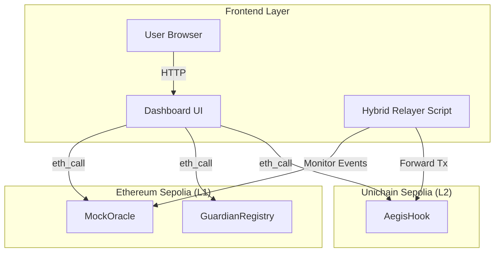

# Frontend Dashboard

## Purpose and Scope

The Frontend Dashboard is a Next.js application that provides a user interface for monitoring and interacting with the Aegis cross-chain circuit breaker system. The application is located in the `frontend/` directory and connects to deployed smart contracts on Unichain Sepolia and Ethereum Sepolia to display system status and Guardian metrics.

This document covers the dashboard's structure, integration patterns, and operational features. For the fallback relay mechanism that runs alongside the dashboard, see [Hybrid Relayer](./Hybrid-Relayer.md). For deployed contract details, see [Deployment](./Deployment.md).

## Technology Stack and Project Structure

### Framework and Language

The dashboard is built with **Next.js** and uses **npm** for package management.

| Component | Evidence/Purpose | Framework |
| --- | --- | --- |
| **Framework** | Application logic and UI | Next.js |
| **Package Manager** | Dependency management | npm |
| **Dev Server** | Local development environment | `npm run dev` |
| **Relay Service** | Background process for L1->L2 bridging | `npm run relay` |

### Directory Structure Context

The `frontend/` directory contains the source code and configuration for the dashboard:

```
aegis/
├── frontend/              # Next.js application directory
│   ├── src/              # Source code
│   ├── .next/            # Build artifacts (ignored)
│   └── out/              # Static export (ignored)
├── contracts/            # Foundry smart contracts
└── README.md             # Project root
```

## Dashboard Capabilities

The dashboard serves as the visualization layer for the cross-chain circuit breaker, providing visibility into:

1.  **Circuit Breaker Status**: Monitor the `AegisHook`'s `panicMode` state on Unichain.
2.  **Guardian Reputation**: View reputation scores from the `GuardianRegistry` on Ethereum Sepolia.
3.  **Intervention Tracking**: Track "heroic interventions" where Guardians provide liquidity during panic mode.
4.  **VIP Lane Activity**: Observe swap activity executed by high-reputation Guardians.

### Contract Integration Requirements

The dashboard connects to three deployed contracts across two networks:

| Network | Contract | Purpose |
| --- | --- | --- |
| **Ethereum Sepolia** | `MockOracle` | Monitor price feed data |
| **Ethereum Sepolia** | `GuardianRegistry` | Query Guardian reputation and history |
| **Unichain Sepolia** | `AegisHook` | Monitor panic mode state and swap activity |

## Application Architecture

The following diagram illustrates how the frontend interacts with the various blockchain networks:



The dashboard uses standard web3 RPC connections to query read-only state from deployed contracts. The Hybrid Relayer runs separately (via `npm run relay`) to handle cross-chain message delivery when the public Reactive Network relayer is congested.

## Development Setup

### Quick Start Commands

To run the dashboard locally:

```bash
# Navigate to frontend directory
cd frontend

# Install dependencies
npm install

# Start the Hybrid Relayer in background (optional, for cross-chain testing)
npm run relay &

# Start the dashboard development server
npm run dev
```

The dashboard will be available at `http://localhost:3000`.

### Concurrent Service Execution

The setup often involves running two services concurrently:

1.  **Dashboard** (`npm run dev`): The Next.js UI for monitoring.
2.  **Relayer** (`npm run relay`): The background script that bridges events from L1 to L2.

This architecture ensures that while the user monitors the system via the UI, the relayer is actively ensuring that L1 events (like price crashes) are correctly propagated to the L2 circuit breaker.

## Relationship to Hybrid Relayer

While both the dashboard and Hybrid Relayer reside in the `frontend/` directory, they serve distinct purposes:

| Component | Location | Operation Type | Purpose |
| --- | --- | --- | --- |
| **Dashboard** | `frontend/src/` | Read-only (`eth_call`) | Visualization & Monitoring |
| **Hybrid Relayer** | `frontend/relay.ts` | Write (`eth_sendTransaction`) | Infrastructure Fallback |

The **Hybrid Relayer** was built to mitigate testnet instability where public relayers on the Reactive Network were occasionally slow. It listens for `PriceUpdate` events on Sepolia and directly triggers the `AegisHook` on Unichain if needed.

## Deployment Considerations

### Static Export

The application is configured to support static exports, making it suitable for hosting on decentralized storage (IPFS) or static hosting services (Vercel, GitHub Pages).

```bash
# Build static files
npm run build 
# Output: frontend/out/
```

### Environment Configuration

For production or testnet deployment, ensure environment variables are set to point to the correct RPC endpoints and contract addresses for the target networks (Ethereum Sepolia and Unichain Sepolia).