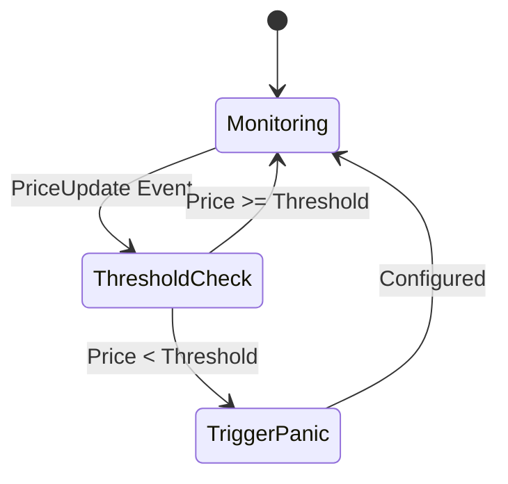
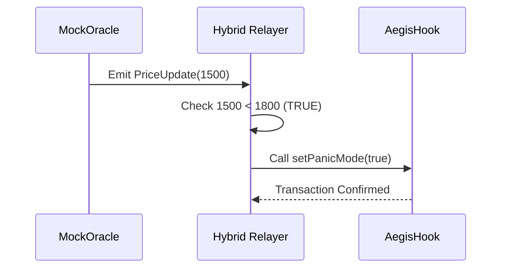

# Hybrid Relayer

## Purpose and Scope

The Hybrid Relayer is an off-chain monitoring and fallback execution component that ensures reliable circuit breaker activation when testnet infrastructure experiences latency or instability. It directly monitors the `MockOracle` contract on Ethereum Sepolia and can trigger panic mode on the `AegisHook` contract on Unichain, bypassing the primary Reactive Network path when necessary.

## Design Rationale

### The Testnet Infrastructure Challenge
The Aegis system's primary monitoring path relies on the Reactive Network to observe events on Ethereum Sepolia and trigger cross-chain calls to Unichain. During development, public testnet relayers can exhibit intermittent reliability issues.

*   **Message Forwarding Delays**: Cross-chain calls delayed by 30-60 seconds.
*   **Relayer Node Instability**: Public nodes occasionally fail to process messages.

### Architectural Decision
The Hybrid Relayer provides a defense-in-depth mechanism:
1.  **Dual-Path Reliability**: Both Reactive Network and Hybrid Relayer monitor the same Oracle events.
2.  **Fast Failover**: If the Reactive path delays, the Hybrid Relayer immediately triggers protection.
3.  **Zero Centralization Cost**: The fallback path operates independently; neither path is a "master" coordinator.

```mermaid
graph TD
    Oracle[MockOracle (L1)] -- PriceUpdate --> Reactive[Reactive Network]
    Oracle -- PriceUpdate --> Relayer[Hybrid Relayer (Off-chain)]
    
    Reactive -- setPanicMode --> Hook[AegisHook (L2)]
    Relayer -- setPanicMode --> Hook
    
    style Relayer fill:#f96,stroke:#333,stroke-width:2px
```

## Component Architecture

The Hybrid Relayer operates as a TypeScript process (`relay.ts`) that performs three core functions:



### Runtime Configuration
The Hybrid Relayer requires several environment variables:
*   `SEPOLIA_RPC_URL`: Connection to Ethereum Sepolia.
*   `UNICHAIN_RPC_URL`: Connection to Unichain.
*   `PRIVATE_KEY`: Signer for transactions to AegisHook.
*   `ORACLE_ADDRESS`: MockOracle contract address.
*   `HOOK_ADDRESS`: AegisHook contract address.

## Operational Flow

### Event Detection and Response



### Parallel Operation with Reactive Sentinel

The Hybrid Relayer operates in parallel with the `AegisSentinel`. Both paths monitor the same events.

*   **Reactive Path**: Fully decentralized, autonomous.
*   **Relayer Path**: Faster (direct RPC), requires a runner.

### Idempotency
The `AegisHook` contract's `setPanicMode()` function is idempotent. Calling it multiple times with the same value is safe. This allows both the Reactive Network and the Hybrid Relayer to attempt to set the panic mode without conflict; the first one to succeed activates the protection, and the second call is a harmless no-op.

## Deployment and Execution

### Starting the Relayer
The Hybrid Relayer is deployed as a background process alongside the frontend application.

```bash
# Navigate to frontend directory
cd frontend

# Install dependencies
npm install

# Start Relayer in background
npm run relay &
```

The `npm run relay` command executes the `relay.ts` script.

## Future Evolution

### Mainnet Strategy
For production deployments, the Hybrid Relayer serves as:
1.  **Temporary Redundancy**: Until Reactive Network infrastructure stabilizes.
2.  **Emergency Override**: A "break glass" mechanism.

### Advanced Monitoring
Potential enhancements include multi-oracle support (Chainlink, Pyth) and dynamic threshold configuration based on volatility indices.