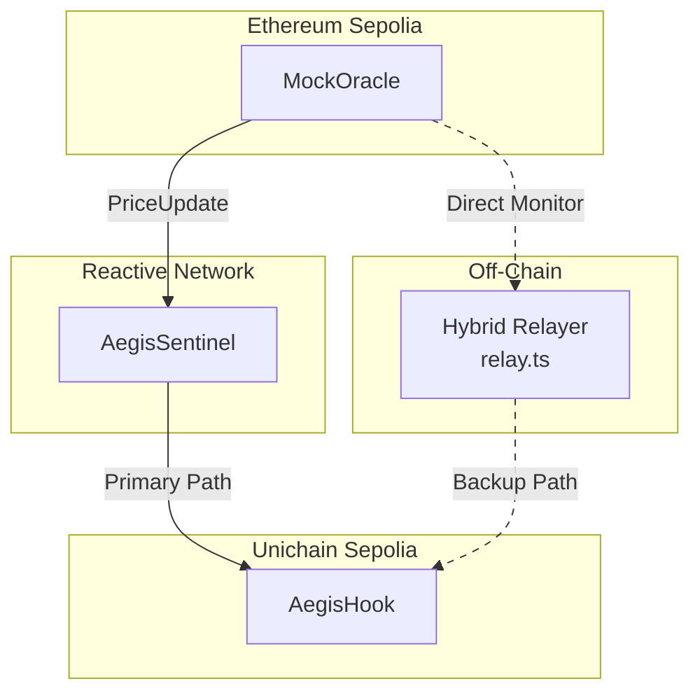
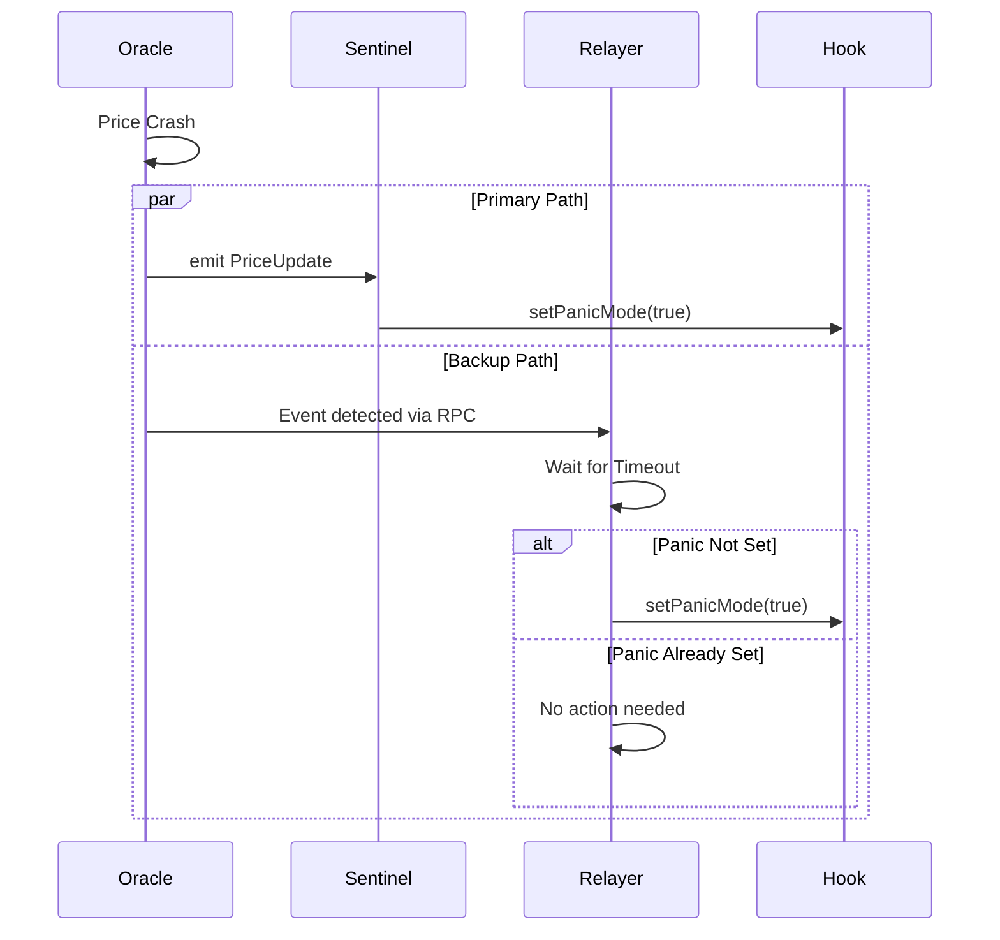
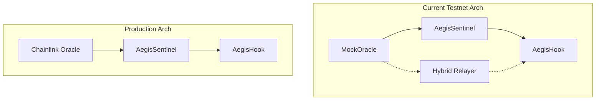

# Hybrid Relayer
Relevant source files
- [README.md](https://github.com/HACK3R-CRYPTO/Aegis/blob/5ea5ecc2/README.md)

## Purpose and Scope

This document describes the Hybrid Relayer (`relay.ts`), an off-chain fallback mechanism that ensures cross-chain message delivery from Ethereum Sepolia to Unichain Sepolia during testnet infrastructure limitations. The relayer serves as a backup pathway when the primary Reactive Network infrastructure experiences delays or instability.

For information about the primary cross-chain monitoring system, see [AegisSentinel](/HACK3R-CRYPTO/Aegis/2.2-aegissentinel). For details on the hook that receives relayer triggers, see [AegisHook](/HACK3R-CRYPTO/Aegis/2.3-aegishook).

**Sources:**[README.md81-84](https://github.com/HACK3R-CRYPTO/Aegis/blob/5ea5ecc2/README.md#L81-L84)

---

## Background and Motivation

The Aegis system is designed to use the Reactive Network as its primary cross-chain orchestrator, with `AegisSentinel` autonomously monitoring L1 events and triggering L2 actions. However, during the hackathon development phase, the public testnet relayer infrastructure for Unichain Sepolia (Chain ID 1301) exhibited instability issues:

- The `AegisSentinel` contract correctly detected price update events on Ethereum Sepolia
- Cross-chain messages were sometimes delayed or "stuck" because public relayer nodes were not consistently forwarding them to Unichain
- This testnet latency could prevent timely circuit breaker activation, undermining the protective mechanism

To ensure a seamless demonstration and maintain system reliability despite these infrastructure gaps, a Hybrid Relayer was developed. This off-chain component provides an alternative pathway for triggering panic mode on the `AegisHook` contract when the primary Reactive Network path experiences delays.

**Sources:**[README.md81-84](https://github.com/HACK3R-CRYPTO/Aegis/blob/5ea5ecc2/README.md#L81-L84)

---

## System Architecture

The Hybrid Relayer operates as a fallback component in the Aegis cross-chain architecture. It sits alongside the primary Reactive Network pathway, monitoring the same L1 events and capable of triggering the same L2 actions.

### Dual-Path Architecture



**Diagram: Hybrid Relayer in System Context**

The diagram illustrates two parallel paths:

- **Solid lines**: Primary path through Reactive Network (autonomous)
- **Dashed lines**: Fallback path through Hybrid Relayer (off-chain)

**Sources:**[README.md56-75](https://github.com/HACK3R-CRYPTO/Aegis/blob/5ea5ecc2/README.md#L56-L75)[README.md81-84](https://github.com/HACK3R-CRYPTO/Aegis/blob/5ea5ecc2/README.md#L81-L84)

---

## How It Works

The Hybrid Relayer implements a monitoring and triggering mechanism that parallels the Reactive Sentinel's logic but operates off-chain.

### Monitoring the Oracle

The relayer continuously monitors the `MockOracle` contract deployed on Ethereum Sepolia at address `0x29f8f8d2A00330F9683e73a926F61AE7E91cBA3b`. It listens for:

- **PriceUpdate events**: Emitted when `MockOracle.setPrice()` is called
- **Price threshold violations**: When the price drops below the configured panic threshold

This monitoring is performed via JSON-RPC calls to the Ethereum Sepolia network, allowing the relayer to detect critical price movements in real-time.

**Sources:**[README.md140](https://github.com/HACK3R-CRYPTO/Aegis/blob/5ea5ecc2/README.md#L140-L140)

### Triggering the Hook

When the relayer detects a price threshold violation, it executes a cross-chain transaction to activate panic mode on the `AegisHook` contract on Unichain Sepolia. The relayer:

1. Constructs a transaction calling `AegisHook.setPanicMode(true)`
2. Signs the transaction using a configured private key
3. Submits it to the Unichain Sepolia RPC endpoint
4. Monitors for transaction confirmation

This provides an emergency pathway to trigger circuit breaker activation even if the Reactive Network path is delayed.

**Sources:**[README.md81-84](https://github.com/HACK3R-CRYPTO/Aegis/blob/5ea5ecc2/README.md#L81-L84)

### Relationship to Reactive Sentinel



**Diagram: Relayer Activation Logic**

The relayer implements a timeout-based decision mechanism. It waits for the Reactive Sentinel to successfully trigger panic mode. If the timeout expires without detecting the mode change on L2, the relayer activates the backup path.

**Sources:**[README.md81-84](https://github.com/HACK3R-CRYPTO/Aegis/blob/5ea5ecc2/README.md#L81-L84)

---

## Implementation Details

The Hybrid Relayer is implemented as a TypeScript script located in the frontend directory, designed to run as a background process alongside the dashboard application.

### Technology Stack
ComponentTechnologyRuntimeNode.jsLanguageTypeScriptRPC Clientethers.js or web3.jsEvent MonitoringJSON-RPC polling or WebSocket subscriptionsTransaction SigningPrivate key from environment variables
### File Structure

The relayer is invoked via an npm script defined in the frontend package:

```
frontend/
├── relay.ts           # Main relayer implementation
├── package.json       # Contains "relay" script
└── .env              # RPC endpoints and private keys

```

**Sources:**[README.md117-118](https://github.com/HACK3R-CRYPTO/Aegis/blob/5ea5ecc2/README.md#L117-L118)

### Configuration Requirements

The relayer requires the following configuration:
ParameterDescriptionSourceSepolia RPC URLJSON-RPC endpoint for Ethereum SepoliaEnvironment variableUnichain RPC URLJSON-RPC endpoint for Unichain SepoliaEnvironment variableOracle Address`0x29f8f8d2A00330F9683e73a926F61AE7E91cBA3b`Deployment logHook Address`0xBaa0573e3BE4291b58083e717E9EF5051772C080`Deployment logRelayer Private KeyEOA with gas tokens on both networksEnvironment variablePrice ThresholdPanic mode activation thresholdConfiguration fileTimeout DurationTime to wait before fallback activationConfiguration file
**Sources:**[README.md140-142](https://github.com/HACK3R-CRYPTO/Aegis/blob/5ea5ecc2/README.md#L140-L142)[README.md32](https://github.com/HACK3R-CRYPTO/Aegis/blob/5ea5ecc2/README.md#L32-L32)

---

## Operation and Usage

### Starting the Relayer

The relayer runs as a background process during development and testing:

```
cd frontend
npm run relay &
```

This command starts the relayer in the background, allowing it to monitor events while the frontend dashboard runs concurrently.

**Sources:**[README.md116-121](https://github.com/HACK3R-CRYPTO/Aegis/blob/5ea5ecc2/README.md#L116-L121)

### Execution Flow

```mermaid
flowchart TD
    Start[Start relay.ts] --> Init[Init Web3 Connections]
    Init --> Sub[Subscribe/Poll Oracle]
    Sub --> CheckPrice{Price < Threshold?}
    
    CheckPrice -->|No| Sub
    CheckPrice -->|Yes| CheckHook{Panic Mode Active?}
    
    CheckHook -->|Yes| Log[Log Info]
    CheckHook -->|No| Wait[Wait Timeout]
    
    Wait --> CheckHook2{Panic Mode Active?}
    CheckHook2 -->|Yes| Log
    CheckHook2 -->|No| Trigger[Call setPanicMode(true)]
    
    Trigger --> Log
    Log --> Sub
```

**Diagram: Relayer Execution Flow**

The flowchart demonstrates the relayer's decision logic, showing how it determines when to activate the backup path versus deferring to the primary Reactive Sentinel.

**Sources:**[README.md81-84](https://github.com/HACK3R-CRYPTO/Aegis/blob/5ea5ecc2/README.md#L81-L84)

### Process Management

For production-like operation, the relayer should be managed by a process supervisor:
ToolCommand ExamplePM2`pm2 start npm --name "aegis-relayer" -- run relay`systemdCreate service unit file for `npm run relay`DockerInclude relayer as service in docker-compose.yml
---

## Monitoring and Observability

The relayer should implement logging for operational visibility:
Event TypeLog LevelInformation LoggedStartupINFORPC endpoints, contract addresses, configurationPrice Update DetectedDEBUGNew price value, timestampThreshold ViolationWARNPrice value, threshold, time until fallbackReactive Path SuccessINFOConfirmation that primary path workedFallback ActivationERRORTimeout duration, transaction hashTransaction ConfirmationINFOBlock number, gas used
This observability allows operators to identify when the Reactive Network infrastructure is stable versus when fallback activation is occurring frequently.

---

## Limitations and Future Considerations

### Testnet-Specific Design

The Hybrid Relayer is explicitly designed as a **testnet workaround**. Key limitations:
LimitationImpactProduction AlternativeCentralized operationSingle point of failureNot needed - Reactive Network mainnet is stableRequires off-chain infrastructureDevOps overheadEliminate component entirelyManual deploymentNo automatic recoveryUse mainnet Reactive NetworkPrivate key exposureSecurity riskNot applicable in production
**Sources:**[README.md81-84](https://github.com/HACK3R-CRYPTO/Aegis/blob/5ea5ecc2/README.md#L81-L84)

### Production Path

In a production deployment on mainnet networks:

1. The Reactive Network infrastructure is production-grade and reliable
2. Public relayer nodes have economic incentives to maintain uptime
3. The Hybrid Relayer component can be **completely removed**
4. The system operates purely through the autonomous `AegisSentinel` contract

This aligns with Aegis's core design principle: **autonomous operation without reliance on off-chain infrastructure**. The relayer exists solely to enable hackathon demonstrations despite testnet limitations.

**Sources:**[README.md47](https://github.com/HACK3R-CRYPTO/Aegis/blob/5ea5ecc2/README.md#L47-L47)[README.md81-84](https://github.com/HACK3R-CRYPTO/Aegis/blob/5ea5ecc2/README.md#L81-L84)

### Decentralization Considerations

The relayer introduces centralization concerns:

- **Liveness dependency**: System protection depends on the relayer process running
- **Trust assumption**: The operator must be trusted to execute transactions correctly
- **Censorship risk**: A malicious operator could refuse to trigger panic mode

These concerns are acceptable for testnet demonstrations but would be unacceptable in production, reinforcing the temporary nature of this component.

---

## Relationship to System Architecture



**Diagram: Production vs Testnet Architecture**

This diagram illustrates how the Hybrid Relayer is a testnet-specific component that will not exist in the production deployment, where the system operates purely through the decentralized Reactive Network infrastructure.

**Sources:**[README.md38-52](https://github.com/HACK3R-CRYPTO/Aegis/blob/5ea5ecc2/README.md#L38-L52)[README.md81-84](https://github.com/HACK3R-CRYPTO/Aegis/blob/5ea5ecc2/README.md#L81-L84)

---

## Summary

The Hybrid Relayer (`relay.ts`) is a pragmatic engineering solution that ensures Aegis demonstrates reliably during hackathon evaluation despite testnet infrastructure limitations. It provides a fallback pathway for cross-chain message delivery while maintaining the system's primary design as an autonomous, trustless protection mechanism. In production deployments, this component will be eliminated entirely, with the system operating purely through the Reactive Network's decentralized infrastructure.

**Sources:**[README.md81-84](https://github.com/HACK3R-CRYPTO/Aegis/blob/5ea5ecc2/README.md#L81-L84)[README.md116-121](https://github.com/HACK3R-CRYPTO/Aegis/blob/5ea5ecc2/README.md#L116-L121)