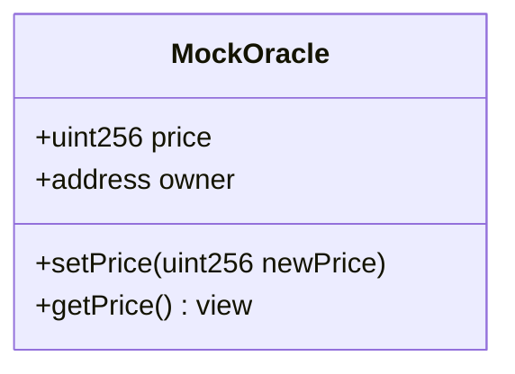
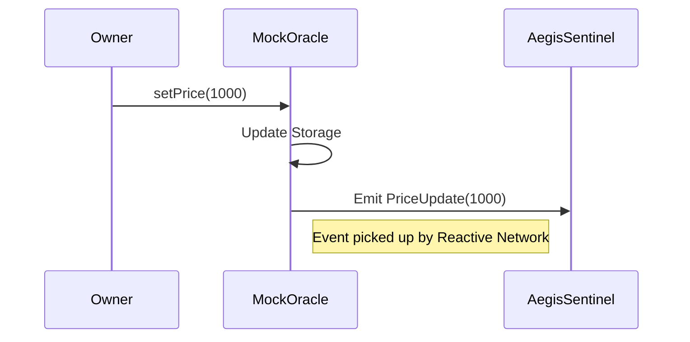

# MockOracle

## Purpose and Scope

The `MockOracle` is a test oracle deployed on **Ethereum Sepolia** (L1) used to simulate price feed behavior for the Aegis system. It allows for deterministic testing of "Black Swan" market crash scenarios by manually setting the reported price.

## Overview

In a real-world scenario, Aegis would connect to a Chainlink Data Feed. However, waiting for a real market crash on a testnet is impractical. The `MockOracle` serves as a controllable substitute that adheres to a standard interface.

*   **Network**: Ethereum Sepolia (Chain ID: 11155111)
*   **Role**: Price Data Source
*   **Key Event**: `PriceUpdate(uint256 newPrice, uint256 timestamp)`

## Contract Architecture

The contract is minimal, consisting of:
1.  **Storage**: A `price` variable.
2.  **Access Control**: An `owner` (the deployer).
3.  **Setter**: `setPrice(uint256)` to update the price and emit an event.



## Integration with Aegis System

The `MockOracle` triggers the entire reactive chain of events:

1.  **Owner** calls `setPrice(1000)` (simulating a crash below the 1500 threshold).
2.  **MockOracle** emits `PriceUpdate(1000)`.
3.  **AegisSentinel** (on Reactive Network) detects this event.
4.  **AegisSentinel** triggers `setPanicMode(true)` on L2.



## Use Cases

### Simulating a Crash
To test the circuit breaker, the operator sets the price below the configured threshold (e.g., 1500).

```bash
cast send $ORACLE_ADDRESS "setPrice(uint256)" 1000 --rpc-url sepolia --private-key $KEY
```

### Resetting to Normal
To deactivate the circuit breaker, the price is set back above the threshold.

```bash
cast send $ORACLE_ADDRESS "setPrice(uint256)" 2000 --rpc-url sepolia --private-key $KEY
```

## Production Migration

Moving to production requires zero changes to the `AegisSentinel` logic, only a configuration update.

1.  Deploy `AegisSentinel` with the address of a real Chainlink Aggregator instead of the `MockOracle`.
2.  Update the event subscription topic to match Chainlink's `AnswerUpdated` event (or similar).

This "plug-and-play" architecture allows Aegis to switch between test and production data sources seamlessly.