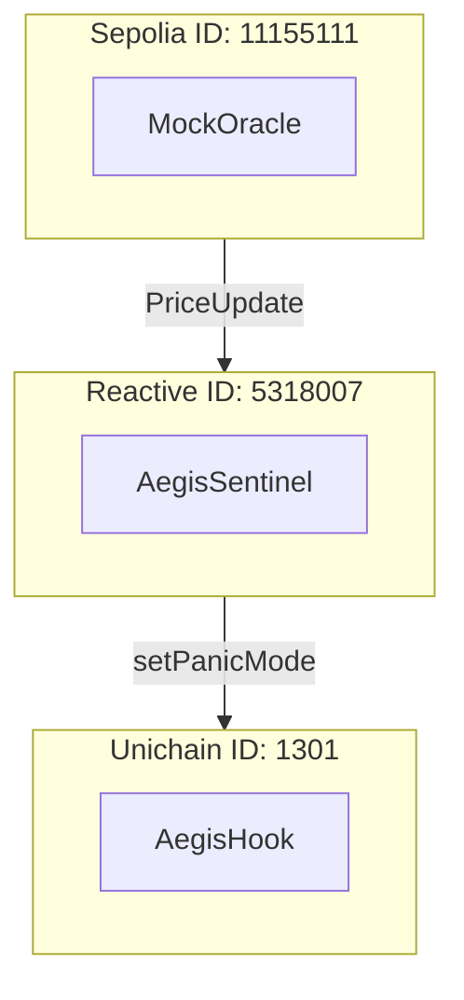

# Network Configuration

## Purpose and Scope

This document provides technical reference for the network configuration of the Aegis system. It covers RPC endpoint setup, chain IDs, and network-specific parameters required for deploying and interacting with Aegis contracts across three blockchain networks: Ethereum Sepolia (L1), Reactive Network Lasna (orchestration layer), and Unichain Sepolia (L2).

For deployment scripts, see [Deployment Scripts](Deployment-Scripts.md). For deployed addresses, see [Deployment](Deployment.md).

## Network Overview

The Aegis system operates across three distinct blockchain networks, each serving a specific architectural role:

| Network Name | Chain ID | Role | Contracts Deployed |
| :--- | :--- | :--- | :--- |
| **Ethereum Sepolia** | 11155111 | L1 Price Oracle & Identity Layer | `MockOracle`, `GuardianRegistry` |
| **Reactive Network Lasna** | 5318007 | Cross-Chain Event Orchestration | `AegisSentinel` |
| **Unichain Sepolia** | 1301 | L2 DEX Hook Enforcement | `AegisHook` |

### Network Architecture Roles



## RPC Endpoint Configuration

### Foundry Configuration File

All network RPC endpoints are centrally defined in the `[rpc_endpoints]` section of `foundry.toml`. This configuration enables Foundry's deployment scripts and CLI tools (`forge`, `cast`) to interact with each network using named aliases.

```toml
[rpc_endpoints]
unichain_sepolia = "https://unichain-sepolia-rpc.publicnode.com"
reactive = "https://lasna-rpc.rnk.dev/"
sepolia = "https://eth-sepolia.g.alchemy.com/v2/YOUR_KEY"
```

### RPC Endpoint Details

| Alias | Network | URL | Purpose |
| :--- | :--- | :--- | :--- |
| `sepolia` | Ethereum Sepolia | Alchemy/Infura | Oracle and Registry deployment |
| `reactive` | Reactive Lasna | `https://lasna-rpc.rnk.dev/` | Sentinel deployment |
| `unichain_sepolia` | Unichain Sepolia | PublicNode | Hook deployment |

## Network-Specific Considerations

### Ethereum Sepolia (L1)

*   **Chain ID**: 11155111
*   **RPC Alias**: `sepolia`
*   **Transaction Type**: EIP-1559 (Type 2)
*   **Deployed Contracts**: `MockOracle` (Price feed source)

### Reactive Network Lasna (Orchestration Layer)

*   **Chain ID**: 5318007
*   **RPC Alias**: `reactive`
*   **Transaction Type**: Legacy (Type 0)
*   **Configuration**: Requires `--legacy` flag for all deployments due to network transaction format requirements.
*   **Deployed Contracts**: `AegisSentinel` (Event listener)

**Special Deployment Procedure**:
```bash
forge script script/05_DeploySentinel.s.sol \
    --rpc-url reactive \
    --broadcast \
    --legacy
```
*Note: The `--legacy` flag is mandatory because Reactive Network does not support EIP-1559.*

### Unichain Sepolia (L2)

*   **Chain ID**: 1301
*   **RPC Alias**: `unichain_sepolia`
*   **Transaction Type**: Optimistic Rollup (EIP-1559 compatible)
*   **Feature**: Flashblocks (sub-second block times)
*   **Deployed Contracts**: `AegisHook` (Uniswap v4 Hook)

**Address Validation Requirement**:
Uniswap v4 hooks must have addresses with specific permission flags encoded in the leading bytes. The `AegisHook` deployment requires salt mining (starting with `0x80` or similar depending on required flags).

## Compiler and EVM Configuration

The Foundry configuration specifies network-agnostic compilation settings that work across all three target networks:

```toml
solc_version = "0.8.26"
evm_version = "cancun"
via_ir = true
```

## Usage in Forge Commands

### Deployment Example

```bash
# Deploy to Ethereum Sepolia
forge script script/04_DeployOracle.s.sol --rpc-url sepolia --broadcast

# Deploy to Reactive Network (note --legacy flag)
forge script script/05_DeploySentinel.s.sol --rpc-url reactive --broadcast --legacy

# Deploy to Unichain Sepolia
forge script script/06_DeployHook.s.sol --rpc-url unichain_sepolia --broadcast
```

### Contract Interaction Example

```bash
# Query Oracle price on Sepolia
cast call $ORACLE_ADDRESS "getLatestPrice()(uint256)" --rpc-url sepolia

# Check panic mode status on Unichain
cast call $HOOK_ADDRESS "panicMode()(bool)" --rpc-url unichain_sepolia
```

## Dependency Remappings

```toml
remappings = [
    "reactive-lib/=lib/system-smart-contracts/lib/reactive-lib/src/",
    "system-smart-contracts/=lib/system-smart-contracts/src/",
    "v4-core/=lib/uniswap-hooks/lib/v4-core/",
    "v4-periphery/=lib/uniswap-hooks/lib/v4-periphery/"
]
```

These remappings ensure that `AegisSentinel` can import Reactive Network SDK components and `AegisHook` can implement Uniswap v4 interfaces.