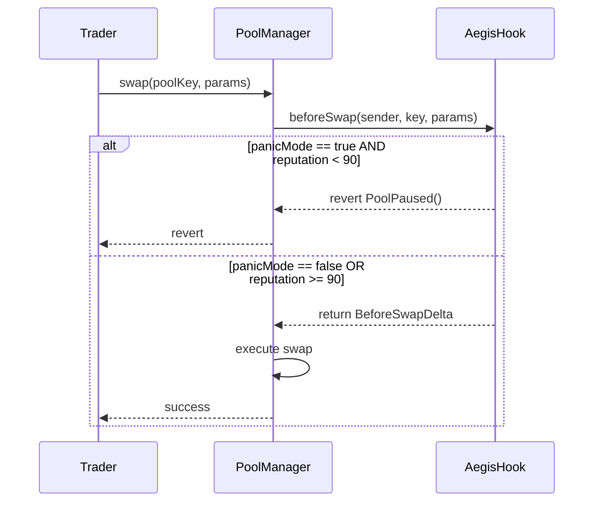
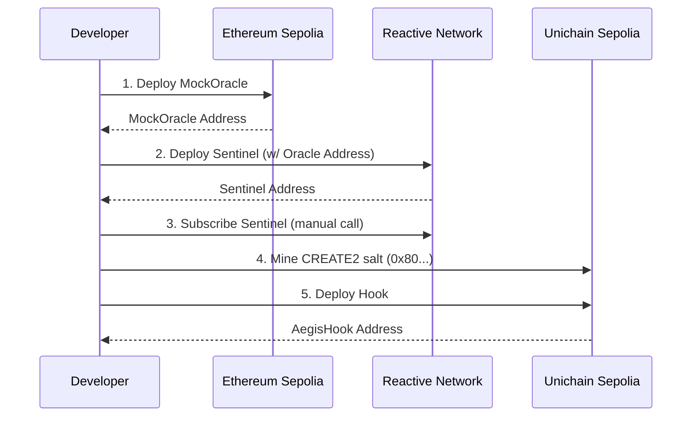
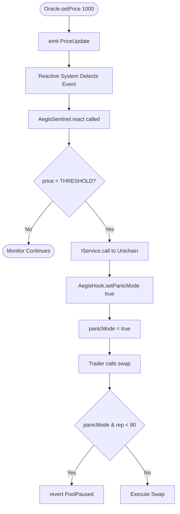
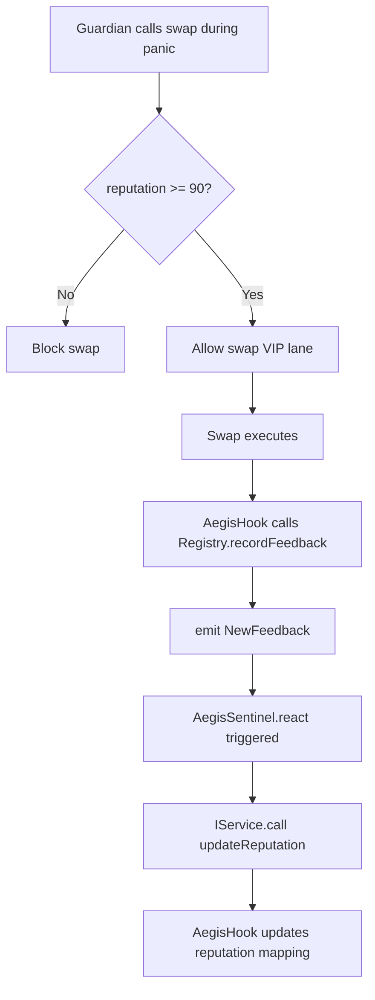

# System Architecture

## Purpose and Scope

This document describes the overall architectural design of the Aegis system, a cross-chain circuit breaker for Uniswap v4 liquidity pools. It covers the three-layer network topology, cross-chain communication patterns, and key design decisions that enable autonomous panic mode activation.

For detailed cross-chain communication mechanisms, see [Cross-Chain Design](#cross-chain-design). For circuit breaker implementation specifics, see [Circuit Breaker Mechanism](#circuit-breaker-mechanism). For individual contract documentation, see [Core Smart Contracts](./Core-Smart-Contracts.md).

## Three-Layer Architecture Overview

Aegis operates across three distinct blockchain networks, each serving a specific architectural role. This separation enables autonomous cross-chain event monitoring without requiring centralized infrastructure.

### Network Layers

| Layer | Network | Chain ID | Role | Key Contracts |
| :--- | :--- | :--- | :--- | :--- |
| **L1** | Ethereum Sepolia | 11155111 | Authority & Data Source | `MockOracle`, `GuardianRegistry` |
| **Orchestration** | Reactive Network Lasna | 5318007 | Event Listener & Controller | `AegisSentinel` |
| **Execution** | Unichain Sepolia | 1301 | Pool Protection & Trading | `AegisHook` |

The three-layer design addresses the "inversion of control" problem: rather than requiring off-chain bots to poll L1 and trigger L2 actions, the `AegisSentinel` contract on Reactive Network autonomously listens to L1 events and executes cross-chain calls to L2.

## System Component Diagram

```mermaid
graph TD
    subgraph L1 [Ethereum Sepolia (Chain 11155111)]
        Oracle[MockOracle]
        Registry[GuardianRegistry]
        Oracle -->|PriceUpdate event| Reactive
        Registry -->|NewFeedback event| Reactive
    end

    subgraph Reactive [Reactive Network Lasna (Chain 5318007)]
        Sentinel[AegisSentinel]
        Sentinel -->|react() callback| Sentinel
        Sentinel -->|IService.call()| Unichain
    end

    subgraph Unichain [Unichain Sepolia (Chain 1301)]
        Hook[AegisHook]
        Pool[PoolManager]
        Hook -->|beforeSwap() gate| Pool
        Trigger[setPanicMode()] --> Hook
        Reputation[boostReputation()] --> Hook
    end
```

This diagram maps system components to their actual contract names and key functions. The `AegisSentinel` contract extends `AbstractReactive` from the Reactive Network SDK, enabling it to listen to L1 events via the `react()` callback function. Cross-chain calls use the `IService.call()` interface to invoke `setPanicMode(bool)` and `updateReputation(address, uint256)` on the `AegisHook` contract.

## Core Architectural Patterns

### 1. Hook-Based Access Control

The `AegisHook` contract implements Uniswap v4's `IHooks` interface, specifically the `beforeSwap()` function. This function is invoked by the `PoolManager` before every swap execution, providing a gating mechanism.

**Key Pattern:** The hook does not pause the entire `PoolManager`; it only controls access to specific pools. Each pool deployed with the `AegisHook` address is independently protected.



**Contract Implementation:**
- Hook deployment uses CREATE2 with a mined salt to achieve an address starting with `0x80...` (indicating `BEFORE_SWAP_FLAG` is set).
- The `beforeSwap()` function checks `panicMode` state variable.
- VIP guardians (reputation >= 90) bypass the panic gate.

### 2. Reactive Event Listening

The `AegisSentinel` contract uses Reactive Network's `AbstractReactive` base contract to subscribe to events on origin chains. This eliminates the need for off-chain relayer infrastructure.

**Key Pattern:** The Sentinel is itself a smart contract, not a traditional bot. It executes autonomously when subscribed events are emitted.

```mermaid
graph LR
    Oracle[Origin Chain: Sepolia] -->|emit PriceUpdate| Reactive[Reactive Network]
    Reactive -->|invoke react()| Sentinel[AegisSentinel]
    Sentinel -->|IService.call()| Unichain[Destination Chain: Unichain]
```

**Contract Implementation:**
- Sentinel implements `react(...)` callback.
- Subscription is registered via manual call to system contract after deployment.
- Cross-chain calls use `IService(SERVICE).call{value: remainingGas}(UNICHAIN_CHAIN_ID, aegisHookAddress, callData)`.

### 3. Reputation-Based Access Tiers

The system implements a dual-tier access model during panic mode. This pattern is inspired by ERC-8004 (Trustless Agents), which standardizes on-chain reputation feedback.

| Access Tier | Condition | Swap Permission | Fee Rate | Use Case |
| :--- | :--- | :--- | :--- | :--- |
| **Standard** | `reputation < 90` | Blocked during panic | 0.30% (normal) | Regular traders |
| **VIP Lane** | `reputation >= 90` | Allowed during panic | 0.01% (reduced) | Trusted guardians |

**Contract Implementation:**
- Reputation stored in `mapping(address => uint256) public guardianReputation`.
- Updated via `updateReputation(address guardian, uint256 newReputation)` function.
- VIP check: `if (panicMode && guardianReputation[sender] < 90) revert PoolPaused();`.

## Network Topology and Deployment

### Address Resolution

The system uses deterministic addressing via CREATE2 for the `AegisHook` contract. The salt is mined to ensure the deployed address has the `BEFORE_SWAP_FLAG` (0x80...) prefix required by Uniswap v4.

### Deployment Sequence

The contracts must be deployed in a specific order due to constructor dependencies.



**Critical Dependency:** The `AegisSentinel` constructor requires the `MockOracle` address as a parameter to subscribe to its events. The `AegisHook` address must be communicated to the Sentinel after deployment for cross-chain calls.

## Design Decisions

### Why Three Chains?

**Alternative Considered:** Deploying all logic on L2 (Unichain) and using off-chain bots to monitor L1.
**Decision:** Use Reactive Network as an intermediate orchestration layer.

**Rationale:**
1.  **Autonomous Operation:** Reactive contracts execute autonomously when events are emitted, eliminating single points of failure from off-chain infrastructure.
2.  **Gas Efficiency:** Reactive Network charges lower gas fees for event listening compared to storing listener logic on L1 or L2.
3.  **Latency:** Cross-chain calls from Reactive to Unichain complete faster than multi-hop bridge messages from L1 → L2.

### Why Uniswap v4 Hooks?

**Alternative Considered:** Deploying a custom AMM with built-in circuit breaker.
**Decision:** Integrate with Uniswap v4 via the `beforeSwap()` hook.

**Rationale:**
1.  **Composability:** Hooks allow injection of custom logic without forking the entire Uniswap v4 codebase.
2.  **Liquidity Network Effects:** Uniswap v4 has deeper liquidity than any new AMM could bootstrap.
3.  **Unichain Flashblocks:** Uniswap v4 on Unichain benefits from 250ms block times, providing faster response than L1 or traditional L2s.

## Data Flow Diagrams

### Panic Mode Activation Flow



### Reputation Feedback Loop

