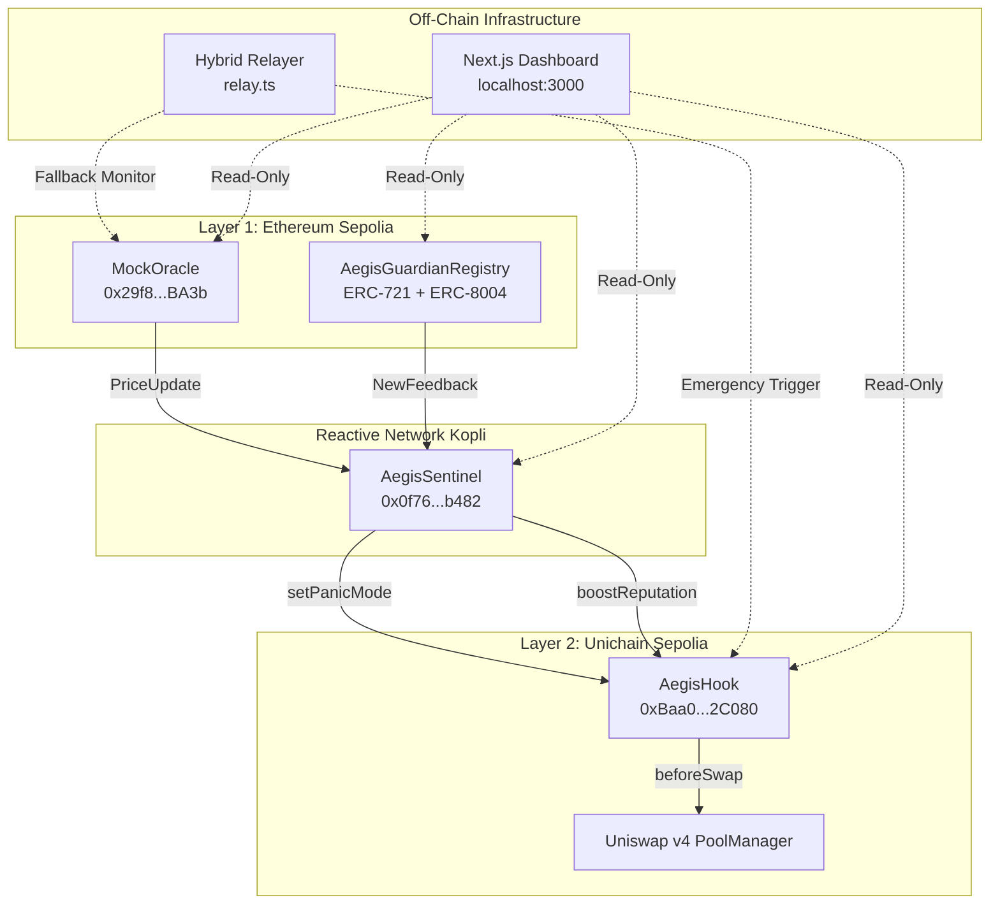
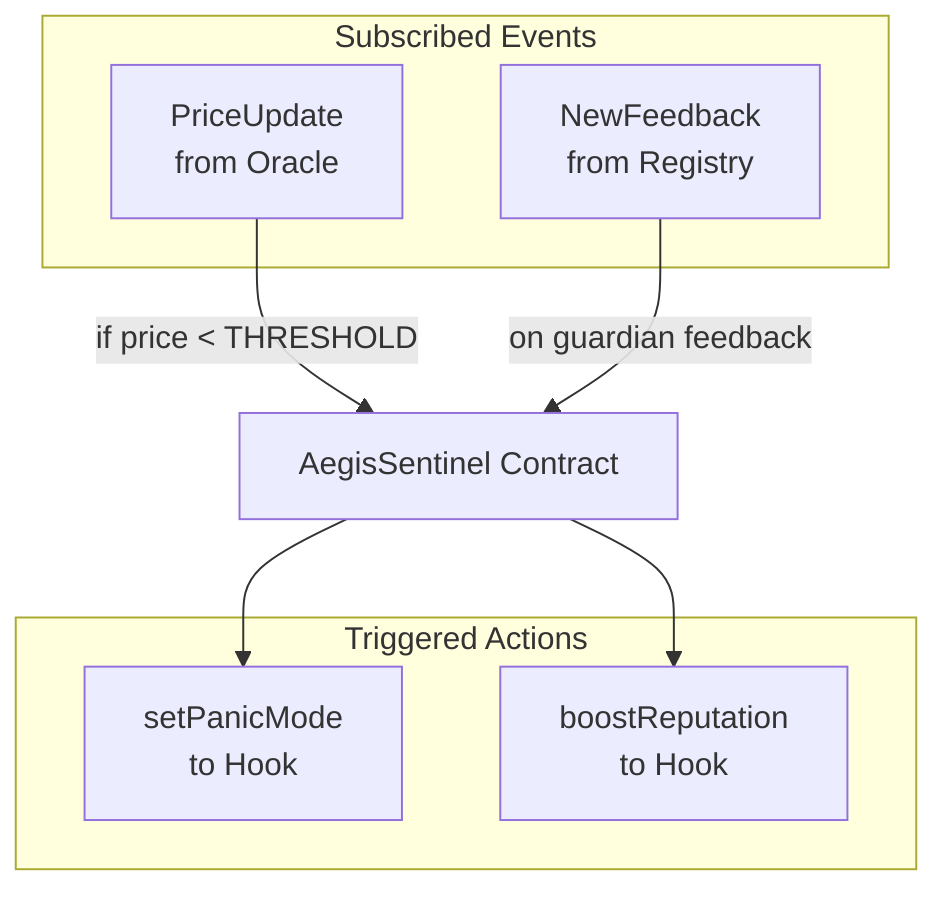
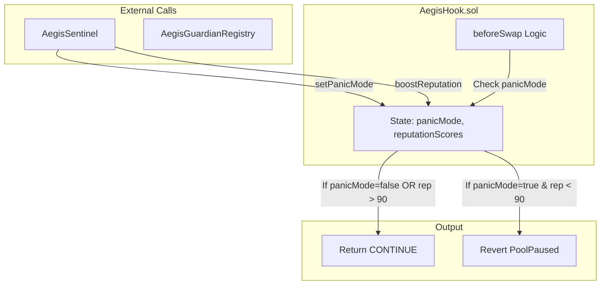
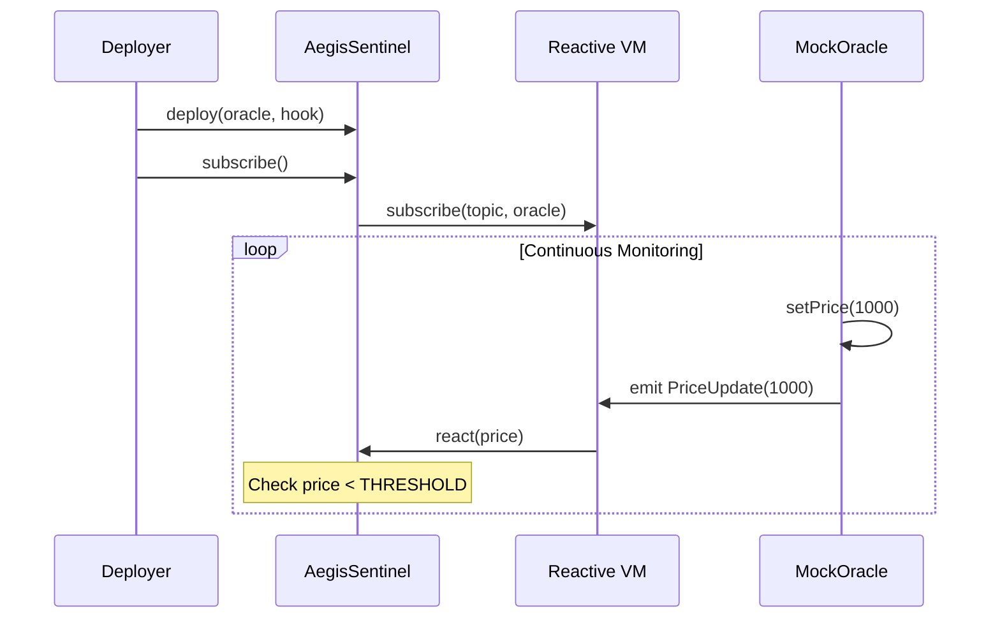
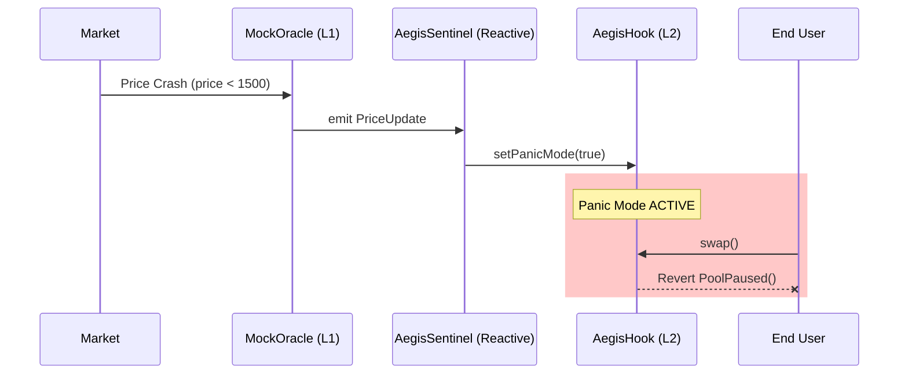
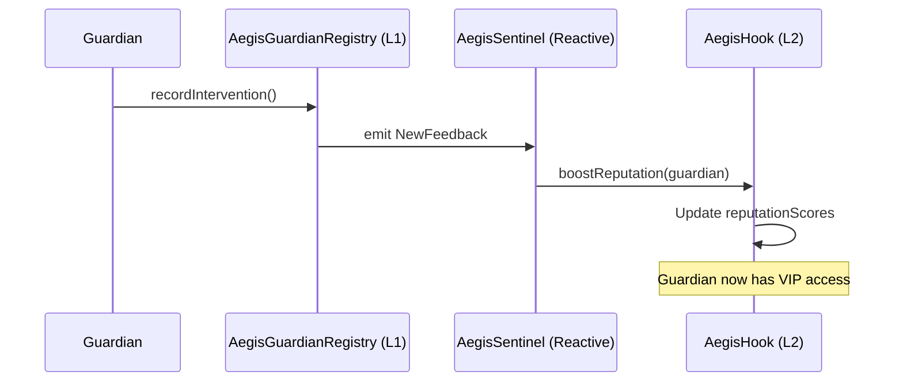

# System Architecture
Relevant source files
- [README.md](https://github.com/HACK3R-CRYPTO/Aegis/blob/5ea5ecc2/README.md)
- [contracts/README.md](https://github.com/HACK3R-CRYPTO/Aegis/blob/5ea5ecc2/contracts/README.md)

## Purpose and Scope

This document details the multi-chain architecture of the Aegis system, explaining how components deployed across Ethereum Sepolia (L1), Reactive Network, and Unichain Sepolia (L2) coordinate to provide autonomous circuit breaker functionality for Uniswap v4 pools.

For information about specific smart contract implementations, see [Smart Contracts](/HACK3R-CRYPTO/Aegis/2-smart-contracts). For deployment procedures and network configuration, see [Deployment](/HACK3R-CRYPTO/Aegis/3-deployment). For details on the reputation system features, see [Key Features](/HACK3R-CRYPTO/Aegis/1.2-key-features).

---

## Network Topology

Aegis operates as a distributed system spanning three blockchain networks plus off-chain infrastructure:



**Sources**: [README.md56-75](https://github.com/HACK3R-CRYPTO/Aegis/blob/5ea5ecc2/README.md#L56-L75)[contracts/README.md11-26](https://github.com/HACK3R-CRYPTO/Aegis/blob/5ea5ecc2/contracts/README.md#L11-L26)

---

## Core Components by Layer

### Layer 1: Ethereum Sepolia

#### MockOracle

The `MockOracle` contract serves as the price feed source. In production, this would be replaced with a Chainlink aggregator.
PropertyValueContract`MockOracle.sol`Address`0x29f8f8d2A00330F9683e73a926F61AE7E91cBA3b`Key Function`setPrice(uint256 _price)`Event Emitted`PriceUpdate(uint256 price, uint256 timestamp)`PurposeTrigger event source for cross-chain monitoring
The contract emits `PriceUpdate` events that are subscribed to by `AegisSentinel` on the Reactive Network. During demonstrations, calling `setPrice(1000)` simulates a 50% market crash to trigger the circuit breaker.

**Sources**: [contracts/README.md46-50](https://github.com/HACK3R-CRYPTO/Aegis/blob/5ea5ecc2/contracts/README.md#L46-L50)[README.md139-140](https://github.com/HACK3R-CRYPTO/Aegis/blob/5ea5ecc2/README.md#L139-L140)

#### AegisGuardianRegistry

The `AegisGuardianRegistry` implements ERC-721 and ERC-8004 standards to manage guardian identities and track reputation on Layer 1.
PropertyValueContract`AegisGuardianRegistry.sol`StandardsERC-721, ERC-8004Key FunctionsGuardian NFT minting, feedback recordingEvent Emitted`NewFeedback(address guardian, uint256 volumeStabilized)`PurposeOn-chain reputation storage and heroic intervention tracking
The registry emits `NewFeedback` events when guardians perform stabilizing actions. The `AegisSentinel` subscribes to these events and propagates reputation updates to the L2 hook.

**Sources**: [contracts/README.md52-57](https://github.com/HACK3R-CRYPTO/Aegis/blob/5ea5ecc2/contracts/README.md#L52-L57)[README.md28-32](https://github.com/HACK3R-CRYPTO/Aegis/blob/5ea5ecc2/README.md#L28-L32)

---

### Reactive Network: Event Monitoring Layer

#### AegisSentinel

The `AegisSentinel` contract is the autonomous orchestrator deployed on Reactive Network Kopli testnet.


PropertyValueContract`AegisSentinel.sol`Address`0x0f764437ffBE1fcd0d0d276a164610422710B482`NetworkReactive Network Kopli (Chain ID: 5318007)Key Functions`react()`, `subscribe()`DependenciesInherits from `AbstractReactive`
The `AegisSentinel` uses the Reactive Network's event subscription mechanism to monitor events on Layer 1 and trigger cross-chain function calls to Layer 2. It implements the autonomous watcher pattern, eliminating the need for centralized keeper infrastructure.

**Deployment Note**: The sentinel requires the `--legacy` flag during deployment for EIP-155 compatibility on Reactive Network.

**Sources**: [contracts/README.md39-44](https://github.com/HACK3R-CRYPTO/Aegis/blob/5ea5ecc2/contracts/README.md#L39-L44)[contracts/README.md115-116](https://github.com/HACK3R-CRYPTO/Aegis/blob/5ea5ecc2/contracts/README.md#L115-L116)[README.md141-142](https://github.com/HACK3R-CRYPTO/Aegis/blob/5ea5ecc2/README.md#L141-L142)

---

### Layer 2: Unichain Sepolia

#### AegisHook

The `AegisHook` is a Uniswap v4 hook contract that implements the circuit breaker mechanism.


PropertyValueContract`AegisHook.sol`Address`0xBaa0573e3BE4291b58083e717E9EF5051772C080`NetworkUnichain Sepolia (Chain ID: 1301)Hook Permissions`BEFORE_SWAP` (0x80... address prefix)Key State`bool panicMode`, `mapping(address => uint256) reputationScores`Access Control`onlySentinel` modifier restricts cross-chain calls
The hook address must have the `BEFORE_SWAP` flag, which is achieved through CREATE2 deployment with a calculated salt. See [Hook Mining](/HACK3R-CRYPTO/Aegis/3.4-hook-mining) for details on the address generation process.

**Key Behavior**:

- When `panicMode == false`: All swaps execute normally
- When `panicMode == true`: Only guardians with `reputationScore > 90` can swap (at reduced 0.01% fees)
- Standard users attempting swaps during panic mode receive a `PoolPaused()` revert

**Sources**: [contracts/README.md32-37](https://github.com/HACK3R-CRYPTO/Aegis/blob/5ea5ecc2/contracts/README.md#L32-L37)[README.md141](https://github.com/HACK3R-CRYPTO/Aegis/blob/5ea5ecc2/README.md#L141-L141)[README.md80](https://github.com/HACK3R-CRYPTO/Aegis/blob/5ea5ecc2/README.md#L80-L80)

---

## Cross-Chain Communication Patterns

### Event Subscription Architecture

The `AegisSentinel` uses the Reactive Network's native event subscription system to monitor Layer 1:



The subscription mechanism is configured during deployment via the `subscribe()` function call, which registers the event topic hash and source contract address with the Reactive Network VM.

**Sources**: [contracts/README.md39-44](https://github.com/HACK3R-CRYPTO/Aegis/blob/5ea5ecc2/contracts/README.md#L39-L44)[README.md46-47](https://github.com/HACK3R-CRYPTO/Aegis/blob/5ea5ecc2/README.md#L46-L47)

---

### Circuit Breaker Activation Flow

The complete sequence from price crash to pool protection:



This flow demonstrates the autonomous nature of the system—no manual intervention or centralized server is required once the contracts are deployed and subscribed.

**Sources**: [README.md56-75](https://github.com/HACK3R-CRYPTO/Aegis/blob/5ea5ecc2/README.md#L56-L75)[contracts/README.md11-26](https://github.com/HACK3R-CRYPTO/Aegis/blob/5ea5ecc2/contracts/README.md#L11-L26)[contracts/README.md89-94](https://github.com/HACK3R-CRYPTO/Aegis/blob/5ea5ecc2/contracts/README.md#L89-L94)

---

### Reputation Synchronization Flow

The bidirectional feedback loop between L1 and L2:



This creates a trustless incentive mechanism where guardians who stabilize pools during volatility automatically earn on-chain reputation that grants them privileged access (lower fees) during future panic events.

**Sources**: [README.md28-32](https://github.com/HACK3R-CRYPTO/Aegis/blob/5ea5ecc2/README.md#L28-L32)[contracts/README.md52-57](https://github.com/HACK3R-CRYPTO/Aegis/blob/5ea5ecc2/contracts/README.md#L52-L57)

---

## Network Configuration

### Chain Identifiers
NetworkChain IDRPC Configuration KeyPurposeEthereum Sepolia11155111`sepolia`Price oracle and reputation registryReactive Network Kopli5318007`reactive`Event monitoring and orchestrationUnichain Sepolia1301`unichain_sepolia`Protected liquidity pools
These chain IDs are configured in `foundry.toml` under the `[rpc_endpoints]` section and referenced by deployment scripts.

**Sources**: [README.md138-142](https://github.com/HACK3R-CRYPTO/Aegis/blob/5ea5ecc2/README.md#L138-L142)[contracts/README.md99-104](https://github.com/HACK3R-CRYPTO/Aegis/blob/5ea5ecc2/contracts/README.md#L99-L104)

---

### Deployed Contract Addresses

The current testnet deployment topology:
ContractNetworkAddressDeployment Script`MockOracle`Ethereum Sepolia`0x29f8f8d2A00330F9683e73a926F61AE7E91cBA3b``04_DeployOracle.s.sol``AegisSentinel`Reactive Kopli`0x0f764437ffBE1fcd0d0d276a164610422710B482``05_DeploySentinel.s.sol``AegisHook`Unichain Sepolia`0xBaa0573e3BE4291b58083e717E9EF5051772C080``06_DeployHook.s.sol`
The deployment sequence is critical: Oracle must be deployed first (to obtain its address for Sentinel subscription), then Sentinel (to obtain its address for Hook access control), then Hook (which requires salt mining for the `BEFORE_SWAP` permission).

**Sources**: [README.md138-142](https://github.com/HACK3R-CRYPTO/Aegis/blob/5ea5ecc2/README.md#L138-L142)[contracts/README.md99-104](https://github.com/HACK3R-CRYPTO/Aegis/blob/5ea5ecc2/contracts/README.md#L99-L104)[contracts/README.md105-122](https://github.com/HACK3R-CRYPTO/Aegis/blob/5ea5ecc2/contracts/README.md#L105-L122)

---

## Off-Chain Infrastructure

### Hybrid Relayer

The `relay.ts` script provides fallback message delivery during testnet infrastructure gaps:
PropertyValueFile`relay.ts`PurposeMonitor Oracle and trigger Hook during relayer downtimeMonitoringPolls `MockOracle.price()` every 5 secondsActionCalls `AegisHook.setPanicMode(true)` if price < thresholdRuntime`npm run relay`
The relayer serves as a temporary solution for testnet reliability issues. In production on mainnet, the Reactive Network's native relayer infrastructure would handle all cross-chain message delivery without requiring this fallback.

**Architecture Decision**: The hybrid approach ensures demo reliability while maintaining the core autonomous design. The relayer monitors the same events as the Sentinel and only acts if the native cross-chain call fails or is delayed.

**Sources**: [README.md81-84](https://github.com/HACK3R-CRYPTO/Aegis/blob/5ea5ecc2/README.md#L81-L84)[README.md116-117](https://github.com/HACK3R-CRYPTO/Aegis/blob/5ea5ecc2/README.md#L116-L117)

---

### Frontend Dashboard

The Next.js application at `localhost:3000` provides read-only monitoring of the system state:

```
Contract Queries

Next.js Dashboard

read-only

read-only

read-only

read-only

React Components

Web3 Hooks

MockOracle.price()

AegisSentinel state

AegisHook.panicMode()

AegisGuardianRegistry stats
```

The dashboard displays real-time oracle prices, panic mode status, guardian reputation leaderboards, and historical intervention data. It does not execute any transactions—all state changes are triggered autonomously by the smart contracts.

**Sources**: [README.md119-121](https://github.com/HACK3R-CRYPTO/Aegis/blob/5ea5ecc2/README.md#L119-L121)

---

## System Design Principles

### Autonomous Operation

The Aegis architecture eliminates the "Inversion of Control" problem typical of keeper-based systems. Once deployed, the contracts operate without centralized servers:

1. **Event-Driven**: The `AegisSentinel` reacts to blockchain events, not polling loops
2. **Self-Executing**: Cross-chain calls are native contract operations, not off-chain message passing
3. **Trustless**: No privileged signers or admin keys required for normal operation

**Sources**: [README.md46-47](https://github.com/HACK3R-CRYPTO/Aegis/blob/5ea5ecc2/README.md#L46-L47)

### Multi-Chain Coordination

The system demonstrates a novel pattern for cross-chain DeFi security:

- **L1 as Source of Truth**: Price feeds and reputation storage remain on Ethereum for security
- **Reactive Layer as Brain**: Event processing and decision logic run on specialized infrastructure
- **L2 as Execution Layer**: Fast block times (250ms Flashblocks) enable sub-second response to L1 events

This separation allows the system to "front-run the front-runners" by detecting price movements on L1 and gating L2 pools before arbitrage bots can exploit stale prices.

**Sources**: [README.md49-51](https://github.com/HACK3R-CRYPTO/Aegis/blob/5ea5ecc2/README.md#L49-L51)[README.md14-15](https://github.com/HACK3R-CRYPTO/Aegis/blob/5ea5ecc2/README.md#L14-L15)